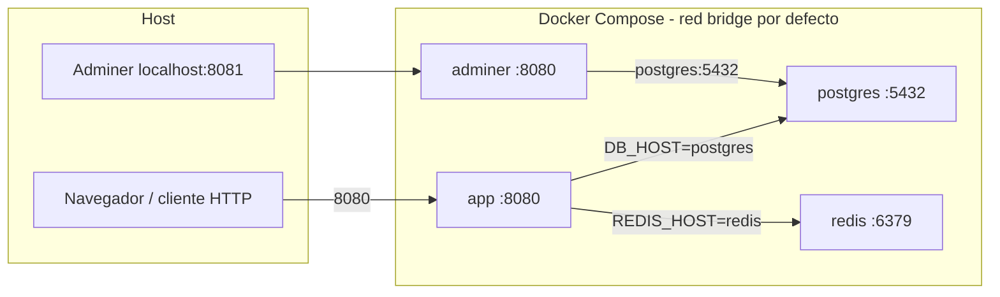

# Arquitectura local con Docker — xavi-api

Este documento describe cómo está construido el backend **xavi-api** (`xavi-platform-node`), cómo se orquestan los contenedores en desarrollo local y cómo Docker Compose enlaza la red entre servicios. Está pensado para que otra herramienta o IA pueda **replicar una arquitectura equivalente** (API Node + PostgreSQL + Redis + herramienta SQL opcional).

---

## 1. Rol del servicio en el sistema

- **Qué es**: API HTTP en Node.js / TypeScript (Express + Apollo GraphQL), base de datos relacional PostgreSQL vía Drizzle ORM, caché/sesiones con Redis.
- **Punto de entrada del proceso**: `src/server.ts` (en desarrollo se ejecuta con `tsx watch`).
- **Puerto de la aplicación**: **8080** (coincide con Cloud Run y con el `EXPOSE` de las imágenes).
- **Superficie HTTP**:
  - REST bajo prefijo **`/api/*`** (ruteado desde `src/routes/` → `src/controllers/`).
  - GraphQL en **`/graphql`** (Apollo Server integrado en Express).

La arquitectura lógica de carpetas y capas está resumida en `AI_CONTEXT.md` en la raíz del repositorio; aquí nos centramos en **empaquetado y Docker**.

---

## 2. Ficheros Docker relevantes

| Archivo | Propósito |
|--------|-----------|
| `Dockerfile` | Build **multi-stage** para producción: compila TypeScript (`npm run build`), imagen final solo con dependencias de producción + `tsx` para migraciones, usuario no root, `ENTRYPOINT` con migraciones antes de arrancar. |
| `Dockerfile.dev` | Imagen para **desarrollo**: Node 18 Alpine, dependencias completas (`npm install`), copia del repo para la build; mismo patrón de entrypoint para esperar BD y migrar. CMD por defecto `npm run dev`. |
| `docker-compose.yml` | Orquestación **local**: PostgreSQL 17, Redis 7, Adminer y servicio `app` que monta código del host para hot reload. |
| `scripts/docker-entrypoint.sh` | Espera a que PostgreSQL acepte conexiones (`psql` con `DATABASE_URL` o variables `DB_*`), ejecuta `npm run migrate`, luego `exec` del comando principal del contenedor. |

**Flujo del entrypoint** (común a dev y prod en contenedor):

1. Bucle hasta que `psql` responde.
2. `npm run migrate` → ejecuta `tsx scripts/migrate.ts`.
3. Sustituye el PID 1 por el comando definido (`CMD` de la imagen o `command:` en Compose).

---

## 3. Servicios definidos en `docker-compose.yml`

### 3.1 `postgres`

- **Imagen**: `postgres:17-alpine`.
- **Variables**: `POSTGRES_DB=xavi_db`, `POSTGRES_USER=xavi_user`, `POSTGRES_PASSWORD=xavi_password`.
- **Puerto host**: `5432:5432`.
- **Persistencia**: volumen nombrado `postgres_data` → datos en `/var/lib/postgresql/data` dentro del contenedor.
- **Healthcheck**: `pg_isready -U xavi_user -d xavi_db` cada 10s.

### 3.2 `redis`

- **Imagen**: `redis:7-alpine`.
- **Puerto host**: `6379:6379`.
- **Persistencia**: volumen nombrado `redis_data` → `/data`.
- **Healthcheck**: `redis-cli ping`.

### 3.3 `adminer`

- **Imagen**: `adminer:latest`.
- **Puerto host**: `8081:8080` (Adminer escucha en 8080 **dentro** del contenedor; en el navegador se usa `http://localhost:8081`).
- **`ADMINER_DEFAULT_SERVER`**: `postgres` → es el **hostname DNS** del servicio Postgres en la red de Compose (ver sección 5).
- **Dependencia**: `depends_on: postgres` (orden de arranque; no sustituye healthcheck de la API).

### 3.4 `app` (API en desarrollo)

- **Build**: contexto `.`, Dockerfile `Dockerfile.dev`.
- **Puerto host**: `8080:8080`.
- **`command`**: `npm run dev` → en `package.json` es `tsx watch src/server.ts` (recarga ante cambios en archivos vigilados por `tsx`).
- **`depends_on`** con **`condition: service_healthy`** sobre `postgres` y `redis` → el contenedor `app` no arranca hasta que ambos pasan healthcheck.

**Variables de entorno inyectadas en Compose** (referencia para replicar el mismo contrato):

- App: `NODE_ENV=development`, `PORT=8080`.
- BD: `DB_HOST=postgres`, `DB_PORT=5432`, `DB_NAME=xavi_db`, `DB_USER=xavi_user`, `DB_PASSWORD=xavi_password`, `DB_MAX_CONNECTIONS=10`.
- Redis: `REDIS_HOST=redis`, `REDIS_PORT=6379`, `ENABLE_REDIS_CACHE=true`.
- JWT y CORS de desarrollo definidos en el propio YAML.
- Email: `EMAIL_API_KEY` y opcionales leídas del `.env` del host (`${EMAIL_API_KEY}`, `${EMAIL_FROM:-...}`, etc.).

**Volúmenes bind-mount** sobre el `app`:

- `./src`, `./scripts`, `./migrations`, `./tsconfig.json` → montados sobre `/app/...` para editar en el host y ver cambios en caliente.
- **Volumen anónimo** `/app/node_modules` → impide que el `node_modules` del host sobrescriba el del contenedor (patrón estándar en Node + bind mounts).

---

## 4. Imagen de producción (`Dockerfile`) frente a desarrollo

**Producción** (`Dockerfile`):

- Stage builder: `npm ci`, copia `src`, `npm run build` → salida en `dist/`.
- Stage final: `npm ci --only=production`, instala `tsx` adicional para migraciones, usuario `nodejs`, CMD `node dist/server.js`.
- APK: `postgresql-client` para `psql` en el entrypoint.

**Desarrollo** (`Dockerfile.dev`):

- `npm install`, copia proyecto completo en build time; el día a día se sobreescribe con bind mounts para `src` (etc.).
- ENTRYPOINT igual concepto que producción (esperar BD + migrar); el comando efectivo viene de Compose (`npm run dev`).

Para construir/imagen prod desde la raíz (sin Compose):

```bash
docker build -t xavi-api .
```

Hay script equivalente en `package.json`: `npm run docker:build`.

---

## 5. Red Docker en local

### 5.1 Red por defecto de Compose

En `docker-compose.yml` **no** se declara una clave `networks:`. Compose crea una red **bridge por proyecto** que incluye a **todos** los servicios del archivo.

Propiedades importantes para replicar el diseño:

- **Nombre DNS estable entre contenedores**: cada servicio es alcanzable por su clave en `services:` (`postgres`, `redis`, `app`, `adminer`).
- Por eso `DB_HOST=postgres` y `REDIS_HOST=redis` funcionan sin IP fijas.
- El tráfico **entre contenedores** usa el puerto **interno** del contenedor destino (5432, 6379, 8080), no el mapeado al host.

### 5.2 Publicación en el host (mapeo `ports`)

| Servicio  | Dentro del contenedor | En la máquina host |
|-----------|----------------------|---------------------|
| postgres  | 5432                  | localhost:5432      |
| redis     | 6379                  | localhost:6379      |
| adminer   | 8080                  | localhost:8081      |
| app       | 8080                  | localhost:8080      |

Si el API se ejecuta **fuera** de Docker pero DB/Redis dentro de Compose, usar `localhost` para `DB_HOST` / `REDIS_HOST` y los puertos publicados — coherente con `.env.example` para trabajo híbrido.

### 5.3 Vista rápida (topología)



---

## 6. Cómo levantar y apagar el entorno

Desde la raíz del repo (requiere Docker Engine + plugin Compose):

```bash
docker compose up -d
```

Scripts NPM que envuelven lo mismo:

- `npm run docker:up` — levantar en segundo plano.
- `npm run docker:logs` — seguir logs.
- `npm run docker:stop` / `docker:down` / `docker:down:clean` (el último baja volúmenes `-v`; **borra datos** de Postgres/Redis locales).

La primera vez, el entrypoint ejecutará migraciones tras conectar con Postgres.

---

## 7. Contrato para otra IA que quiera montar algo “similar”

Checklist reproducible sin acoplar nombres de marca:

1. **Cuatro procesos**: API Node, PostgreSQL, Redis y (opcional) cliente web tipo Adminer/pgAdmin.
2. **Un único archivo Compose** que:
   - use **healthchecks** en Postgres y Redis;
   - haga **`depends_on` con `service_healthy`** en el servicio de la API;
   - exponga API en un puerto fijo (aquí 8080);
   - use **nombres de servicio** como hostnames para BD y Redis.
3. **Entrypoint de la API** que:
   - espere a BD con herramienta oficial del motor (aquí `psql`);
   - ejecute migraciones **antes** de arrancar el servidor;
   - delegue en `CMD`/`command` la orden final (`node dist/...` o `tsx watch ...`).
4. **Desarrollo**: Dockerfile distinto al de prod; bind mount de código fuente; volumen anónimo sobre `node_modules`.
5. **Producción**: multi-stage build, solo `dist/` + deps prod, proceso no root si es posible, `dumb-init` opcional como PID 1 auxiliar.

### Variables mínimas que la aplicación espera para conectar (patrón de este repo)

- Base de datos: `DB_HOST`, `DB_PORT`, `DB_USER`, `DB_PASSWORD`, `DB_NAME` (y opcionalmente `DATABASE_URL` en otros entornos, soportado en el shell del entrypoint).
- Redis (si está activo): `REDIS_HOST`, `REDIS_PORT`, `ENABLE_REDIS_CACHE=true`.
- Ejecución de la app: `PORT`, `NODE_ENV`.

Para sustituir nombres de base de usuario, contraseña o base de datos, mantenerlos **consistentes** entre Postgres (`POSTGRES_*`) y las variables `DB_*` del servicio `app`.

### Nota sobre `.env` y Compose

`docker-compose.yml` referencia `${EMAIL_API_KEY}` (y similares). Compose lee por defecto un archivo `.env` en el directorio del compose para **interpolación**; conviene tener esas claves definidas ahí si se usa correo en local, o exportarlas en el shell antes de `docker compose up`.

El fichero `.env.example` describe muchas variables del proyecto para ejecución **nativa**; los valores efectivos para el stack Compose de este repo están **inline** en `docker-compose.yml` para Postgres/Redis/JWT donde aplica — al replicar, tratar el Compose como fuente de verdad para ese stack concreto.

---

## 8. Referencias en el código

- Orquestación: `docker-compose.yml`
- Producción vs dev: `Dockerfile`, `Dockerfile.dev`
- Arranque con migraciones: `scripts/docker-entrypoint.sh`
- Inicialización de pools al runtime: `src/shared/config/index.ts` (`initializeServices`)
- Contexto amplio del monorepo API: `AI_CONTEXT.md`

Con esto se puede reproducir tanto el **diseño de red Compose** como el **patrón de arranque** (esperar BD → migrar → servidor) típico de APIs Node desplegables en Cloud Run pero desarrolladas con contenedores locales.
