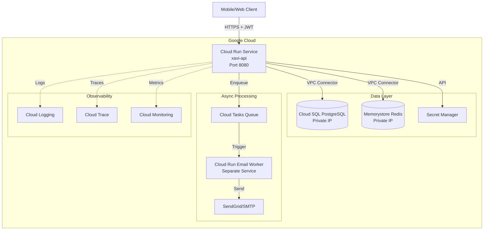

# Cloud Run Architecture - Container-Based Deployment

## Overview

This document defines the **Cloud Run architecture** for deploying Xavier as a containerized Node.js application on Google Cloud Platform. This approach differs from the multi-function serverless approach and provides a simpler, more traditional deployment model.

---

## Architecture Principles

1. **Single Container**: One Docker container handles all routes (vs 10 separate functions)
2. **HTTP Server**: Express/Fastify server with internal routing
3. **Long-lived Connections**: Persistent database and Redis pools
4. **Horizontal Scaling**: Cloud Run auto-scales containers based on load
5. **VPC Integration**: Direct connection to Cloud SQL and Memorystore
6. **Container-optimized**: Health checks, graceful shutdown, signal handling
7. **Cost-effective**: Scale to zero when idle, pay per request

---

## Architecture Diagram



---

## Container Architecture

### Single Server Design

Unlike the multi-function approach, Cloud Run uses **one unified HTTP server**:

```typescript
// src/server.ts
import express from "express";
import { setupMiddleware } from "./shared/middleware";
import { setupRoutes } from "./routes";
import { initializeServices } from "./shared/config";

const app = express();
const PORT = parseInt(process.env.PORT || "8080", 10);

// Global middleware
setupMiddleware(app);

// Initialize services (DB pool, Redis client)
await initializeServices();

// Route handlers
setupRoutes(app);

// Health checks
app.get("/health", (req, res) => res.json({ status: "ok" }));
app.get("/ready", async (req, res) => {
  // Check DB and Redis connectivity
  const isReady = await checkServices();
  res.status(isReady ? 200 : 503).json({ ready: isReady });
});

// Start server
const server = app.listen(PORT, "0.0.0.0", () => {
  console.log(`Server listening on port ${PORT}`);
});

// Graceful shutdown
process.on("SIGTERM", async () => {
  console.log("SIGTERM signal received: closing HTTP server");
  server.close(async () => {
    await shutdownServices(); // Close DB, Redis connections
    process.exit(0);
  });
});

process.on("SIGINT", async () => {
  console.log("SIGINT signal received: closing HTTP server");
  server.close(async () => {
    await shutdownServices();
    process.exit(0);
  });
});
```

### Route Structure

```typescript
// src/routes/index.ts
import { Express } from "express";
import authRoutes from "./auth";
import activityRoutes from "./activity";
import habitRoutes from "./habit";
import todoRoutes from "./todo";
import walletRoutes from "./wallet";
import shoppingRoutes from "./shopping";
import routineRoutes from "./routine";
import learningRoutes from "./learning";
import courseRoutes from "./course";
import sleepRoutes from "./sleep";

export function setupRoutes(app: Express) {
  // Auth routes (no /v1 prefix)
  app.use("/auth", authRoutes);

  // API routes with /v1 prefix
  app.use("/v1/activity-categories", activityRoutes.categories);
  app.use("/v1/activity", activityRoutes.activities);
  app.use("/v1/habit-categories", habitRoutes.categories);
  app.use("/v1/habit", habitRoutes.habits);
  app.use("/v1/todo", todoRoutes);
  app.use("/v1/wallet", walletRoutes);
  app.use("/v1/shopping", shoppingRoutes);
  app.use("/v1/routine", routineRoutes);
  app.use("/v1/learning", learningRoutes);
  app.use("/v1/programming", learningRoutes.programming);
  app.use("/v1/tags", learningRoutes.tags);
  app.use("/v1/courses", courseRoutes);
  app.use("/v1/sleep-tracker", sleepRoutes);
}
```

---

## Dockerfile

```dockerfile
# Multi-stage build for optimized image size
FROM node:18-alpine AS builder

WORKDIR /app

# Copy package files
COPY package*.json ./
COPY tsconfig.json ./

# Install dependencies (including dev dependencies for build)
RUN npm ci

# Copy source code
COPY src ./src

# Build TypeScript
RUN npm run build

# Production stage
FROM node:18-alpine

WORKDIR /app

# Copy package files
COPY package*.json ./

# Install production dependencies only
RUN npm ci --only=production && npm cache clean --force

# Copy built application from builder stage
COPY --from=builder /app/dist ./dist

# Create non-root user
RUN addgroup -g 1001 -S nodejs && \
    adduser -S nodejs -u 1001

# Change ownership
RUN chown -R nodejs:nodejs /app

# Switch to non-root user
USER nodejs

# Expose port (Cloud Run will override with $PORT)
EXPOSE 8080

# Health check
HEALTHCHECK --interval=30s --timeout=3s --start-period=5s --retries=3 \
  CMD node -e "require('http').get('http://localhost:8080/health', (r) => {process.exit(r.statusCode === 200 ? 0 : 1)})"

# Start server
CMD ["node", "dist/server.js"]
```

### Optimized Dockerfile (Advanced)

```dockerfile
# Use distroless for smaller, more secure image
FROM node:18-alpine AS builder
WORKDIR /app
COPY package*.json tsconfig.json ./
RUN npm ci
COPY src ./src
RUN npm run build

FROM gcr.io/distroless/nodejs18-debian11
WORKDIR /app
COPY --from=builder /app/dist ./dist
COPY --from=builder /app/node_modules ./node_modules
COPY package.json ./
USER nonroot
CMD ["dist/server.js"]
```

---

## Database Connection Pooling

### Cloud SQL Connection

```typescript
// src/shared/database/pool.ts
import { Pool, PoolConfig } from "pg";
import { logger } from "../logger";

let pool: Pool | null = null;

export function initializeDbPool(): Pool {
  if (pool) return pool;

  const isCloudRun = process.env.K_SERVICE !== undefined;

  const config: PoolConfig = {
    host: isCloudRun
      ? `/cloudsql/${process.env.CLOUD_SQL_CONNECTION_NAME}` // Unix socket
      : process.env.DB_HOST, // TCP for local
    port: isCloudRun ? undefined : parseInt(process.env.DB_PORT || "5432", 10),
    user: process.env.DB_USER,
    password: process.env.DB_PASSWORD,
    database: process.env.DB_NAME,

    // Connection pool settings for Cloud Run
    max: 10, // Max connections per container
    min: 2, // Min connections to keep alive
    idleTimeoutMillis: 30000, // Close idle connections after 30s
    connectionTimeoutMillis: 5000,

    // Keep-alive to prevent connection drops
    keepAlive: true,
    keepAliveInitialDelayMillis: 10000,
  };

  pool = new Pool(config);

  // Error handling
  pool.on("error", (err) => {
    logger.error({ err }, "Unexpected database pool error");
  });

  // Logging
  pool.on("connect", () => {
    logger.debug("New database connection established");
  });

  pool.on("remove", () => {
    logger.debug("Database connection removed from pool");
  });

  logger.info(
    {
      max: config.max,
      min: config.min,
      host: isCloudRun ? "unix-socket" : config.host,
    },
    "Database pool initialized",
  );

  return pool;
}

export function getDbPool(): Pool {
  if (!pool) {
    throw new Error(
      "Database pool not initialized. Call initializeDbPool() first.",
    );
  }
  return pool;
}

export async function shutdownDbPool(): Promise<void> {
  if (pool) {
    logger.info("Closing database pool...");
    await pool.end();
    pool = null;
    logger.info("Database pool closed");
  }
}
```

### Redis Connection

```typescript
// src/shared/redis/client.ts
import Redis from "ioredis";
import { logger } from "../logger";

let redisClient: Redis | null = null;

export function initializeRedisClient(): Redis {
  if (redisClient) return redisClient;

  const isCloudRun = process.env.K_SERVICE !== undefined;

  redisClient = new Redis({
    host: process.env.REDIS_HOST,
    port: parseInt(process.env.REDIS_PORT || "6379", 10),
    password: process.env.REDIS_PASSWORD,

    // Retry strategy
    retryStrategy: (times) => {
      if (times > 3) {
        logger.error("Redis retry limit exceeded");
        return null; // Stop retrying
      }
      const delay = Math.min(times * 50, 2000);
      return delay;
    },

    // Connection settings
    maxRetriesPerRequest: 3,
    enableReadyCheck: true,
    enableOfflineQueue: false, // Fail fast in Cloud Run

    // Keep-alive
    keepAlive: 30000,
  });

  redisClient.on("error", (err) => {
    logger.error({ err }, "Redis client error");
  });

  redisClient.on("connect", () => {
    logger.info("Redis client connected");
  });

  redisClient.on("ready", () => {
    logger.info("Redis client ready");
  });

  return redisClient;
}

export function getRedisClient(): Redis {
  if (!redisClient) {
    throw new Error(
      "Redis client not initialized. Call initializeRedisClient() first.",
    );
  }
  return redisClient;
}

export async function shutdownRedisClient(): Promise<void> {
  if (redisClient) {
    logger.info("Closing Redis client...");
    await redisClient.quit();
    redisClient = null;
    logger.info("Redis client closed");
  }
}
```

---

## Cloud Run Configuration

### service.yaml

```yaml
apiVersion: serving.knative.dev/v1
kind: Service
metadata:
  name: xavi-api
  annotations:
    run.googleapis.com/launch-stage: BETA
spec:
  template:
    metadata:
      annotations:
        # Autoscaling
        autoscaling.knative.dev/minScale: "1" # Keep 1 instance warm (avoid cold starts)
        autoscaling.knative.dev/maxScale: "100" # Max 100 instances

        # Cloud SQL connection
        run.googleapis.com/cloudsql-instances: PROJECT_ID:REGION:INSTANCE_NAME

        # VPC connector for Memorystore Redis
        run.googleapis.com/vpc-access-connector: projects/PROJECT_ID/locations/REGION/connectors/xavi-connector
        run.googleapis.com/vpc-access-egress: private-ranges-only

        # CPU allocation
        run.googleapis.com/cpu-throttling: "false" # Keep CPU allocated even when idle

        # Execution environment
        run.googleapis.com/execution-environment: gen2

    spec:
      serviceAccountName: xavi-api-sa@PROJECT_ID.iam.gserviceaccount.com

      containerConcurrency: 80 # Max 80 concurrent requests per container
      timeoutSeconds: 60 # Max 60s per request

      containers:
        - name: xavi-api
          image: gcr.io/PROJECT_ID/xavi-api:latest

          ports:
            - name: http1
              containerPort: 8080

          resources:
            limits:
              cpu: "1000m" # 1 vCPU
              memory: "512Mi" # 512 MB RAM

          env:
            - name: NODE_ENV
              value: "production"

            - name: DB_USER
              valueFrom:
                secretKeyRef:
                  name: xavi-db-user
                  key: latest

            - name: DB_PASSWORD
              valueFrom:
                secretKeyRef:
                  name: xavi-db-password
                  key: latest

            - name: DB_NAME
              value: "xavier_db"

            - name: CLOUD_SQL_CONNECTION_NAME
              value: "PROJECT_ID:REGION:INSTANCE_NAME"

            - name: REDIS_HOST
              value: "10.0.0.3" # Memorystore private IP

            - name: REDIS_PORT
              value: "6379"

            - name: JWT_SECRET
              valueFrom:
                secretKeyRef:
                  name: xavi-jwt-secret
                  key: latest

            - name: JWT_REFRESH_SECRET
              valueFrom:
                secretKeyRef:
                  name: xavi-jwt-refresh-secret
                  key: latest

          startupProbe:
            httpGet:
              path: /health
              port: 8080
            initialDelaySeconds: 10
            periodSeconds: 5
            failureThreshold: 3

          livenessProbe:
            httpGet:
              path: /health
              port: 8080
            initialDelaySeconds: 30
            periodSeconds: 10
            timeoutSeconds: 3
            failureThreshold: 3

          readinessProbe:
            httpGet:
              path: /ready
              port: 8080
            initialDelaySeconds: 5
            periodSeconds: 5
            timeoutSeconds: 3
            failureThreshold: 2

  traffic:
    - percent: 100
      latestRevision: true
```

---

## Terraform Configuration

### main.tf

```hcl
terraform {
  required_version = ">= 1.0"

  required_providers {
    google = {
      source  = "hashicorp/google"
      version = "~> 5.0"
    }
  }

  backend "gcs" {
    bucket = "xavi-terraform-state"
    prefix = "cloud-run"
  }
}

provider "google" {
  project = var.project_id
  region  = var.region
}

variable "project_id" {
  description = "GCP Project ID"
  type        = string
}

variable "region" {
  description = "GCP Region"
  type        = string
  default     = "us-central1"
}

variable "environment" {
  description = "Environment (dev, staging, prod)"
  type        = string
}

# VPC for private connectivity
resource "google_compute_network" "vpc" {
  name                    = "xavi-vpc-${var.environment}"
  auto_create_subnetworks = false
}

resource "google_compute_subnetwork" "subnet" {
  name          = "xavi-subnet-${var.environment}"
  ip_cidr_range = "10.0.0.0/24"
  region        = var.region
  network       = google_compute_network.vpc.id
}

# VPC Access Connector for Cloud Run
resource "google_vpc_access_connector" "connector" {
  name          = "xavi-connector-${var.environment}"
  region        = var.region
  network       = google_compute_network.vpc.name
  ip_cidr_range = "10.8.0.0/28"

  min_instances = 2
  max_instances = 3

  machine_type = "e2-micro"
}

# Cloud SQL PostgreSQL
resource "google_sql_database_instance" "main" {
  name             = "xavi-db-${var.environment}"
  database_version = "POSTGRES_15"
  region           = var.region

  settings {
    tier              = var.environment == "prod" ? "db-custom-2-4096" : "db-f1-micro"
    availability_type = var.environment == "prod" ? "REGIONAL" : "ZONAL"
    disk_size         = 10
    disk_type         = "PD_SSD"

    backup_configuration {
      enabled                        = true
      start_time                     = "03:00"
      point_in_time_recovery_enabled = var.environment == "prod"
      transaction_log_retention_days = 7
    }

    ip_configuration {
      ipv4_enabled    = false
      private_network = google_compute_network.vpc.id
      require_ssl     = true
    }

    database_flags {
      name  = "max_connections"
      value = "100"
    }
  }

  deletion_protection = var.environment == "prod"
}

resource "google_sql_database" "database" {
  name     = "xavier_db"
  instance = google_sql_database_instance.main.name
}

resource "google_sql_user" "user" {
  name     = "xavi_app"
  instance = google_sql_database_instance.main.name
  password = random_password.db_password.result
}

# Memorystore Redis
resource "google_redis_instance" "cache" {
  name           = "xavi-redis-${var.environment}"
  tier           = var.environment == "prod" ? "STANDARD_HA" : "BASIC"
  memory_size_gb = var.environment == "prod" ? 2 : 1
  region         = var.region

  authorized_network = google_compute_network.vpc.id
  connect_mode       = "PRIVATE_SERVICE_ACCESS"

  redis_version = "REDIS_7_0"

  maintenance_policy {
    weekly_maintenance_window {
      day = "SUNDAY"
      start_time {
        hours   = 3
        minutes = 0
      }
    }
  }
}

# Secret Manager secrets
resource "random_password" "db_password" {
  length  = 32
  special = true
}

resource "google_secret_manager_secret" "db_password" {
  secret_id = "xavi-db-password-${var.environment}"

  replication {
    auto {}
  }
}

resource "google_secret_manager_secret_version" "db_password" {
  secret      = google_secret_manager_secret.db_password.id
  secret_data = random_password.db_password.result
}

resource "random_password" "jwt_secret" {
  length  = 64
  special = false
}

resource "google_secret_manager_secret" "jwt_secret" {
  secret_id = "xavi-jwt-secret-${var.environment}"

  replication {
    auto {}
  }
}

resource "google_secret_manager_secret_version" "jwt_secret" {
  secret      = google_secret_manager_secret.jwt_secret.id
  secret_data = random_password.jwt_secret.result
}

# Service Account
resource "google_service_account" "cloud_run" {
  account_id   = "xavi-api-sa-${var.environment}"
  display_name = "Xavier Cloud Run Service Account"
}

# IAM permissions
resource "google_project_iam_member" "cloud_sql_client" {
  project = var.project_id
  role    = "roles/cloudsql.client"
  member  = "serviceAccount:${google_service_account.cloud_run.email}"
}

resource "google_secret_manager_secret_iam_member" "secret_accessor" {
  for_each = toset([
    google_secret_manager_secret.db_password.secret_id,
    google_secret_manager_secret.jwt_secret.secret_id,
  ])

  secret_id = each.value
  role      = "roles/secretmanager.secretAccessor"
  member    = "serviceAccount:${google_service_account.cloud_run.email}"
}

# Cloud Run Service
resource "google_cloud_run_v2_service" "api" {
  name     = "xavi-api-${var.environment}"
  location = var.region
  ingress  = "INGRESS_TRAFFIC_ALL"

  template {
    service_account = google_service_account.cloud_run.email

    scaling {
      min_instance_count = var.environment == "prod" ? 1 : 0
      max_instance_count = var.environment == "prod" ? 100 : 10
    }

    vpc_access {
      connector = google_vpc_access_connector.connector.id
      egress    = "PRIVATE_RANGES_ONLY"
    }

    containers {
      image = "gcr.io/${var.project_id}/xavi-api:latest"

      ports {
        container_port = 8080
      }

      resources {
        limits = {
          cpu    = "1000m"
          memory = "512Mi"
        }

        cpu_idle = false
      }

      env {
        name  = "NODE_ENV"
        value = var.environment == "prod" ? "production" : "development"
      }

      env {
        name  = "CLOUD_SQL_CONNECTION_NAME"
        value = google_sql_database_instance.main.connection_name
      }

      env {
        name  = "DB_NAME"
        value = google_sql_database.database.name
      }

      env {
        name  = "DB_USER"
        value = google_sql_user.user.name
      }

      env {
        name = "DB_PASSWORD"
        value_source {
          secret_key_ref {
            secret  = google_secret_manager_secret.db_password.secret_id
            version = "latest"
          }
        }
      }

      env {
        name  = "REDIS_HOST"
        value = google_redis_instance.cache.host
      }

      env {
        name  = "REDIS_PORT"
        value = tostring(google_redis_instance.cache.port)
      }

      env {
        name = "JWT_SECRET"
        value_source {
          secret_key_ref {
            secret  = google_secret_manager_secret.jwt_secret.secret_id
            version = "latest"
          }
        }
      }

      startup_probe {
        http_get {
          path = "/health"
          port = 8080
        }
        initial_delay_seconds = 10
        period_seconds        = 5
        failure_threshold     = 3
      }

      liveness_probe {
        http_get {
          path = "/health"
          port = 8080
        }
        initial_delay_seconds = 30
        period_seconds        = 10
        timeout_seconds       = 3
        failure_threshold     = 3
      }
    }
  }

  traffic {
    type    = "TRAFFIC_TARGET_ALLOCATION_TYPE_LATEST"
    percent = 100
  }
}

# Allow unauthenticated access (API uses JWT)
resource "google_cloud_run_v2_service_iam_member" "public_access" {
  name   = google_cloud_run_v2_service.api.name
  location = google_cloud_run_v2_service.api.location
  role   = "roles/run.invoker"
  member = "allUsers"
}

# Outputs
output "cloud_run_url" {
  value = google_cloud_run_v2_service.api.uri
}

output "db_connection_name" {
  value = google_sql_database_instance.main.connection_name
}

output "redis_host" {
  value = google_redis_instance.cache.host
}
```

---

## CI/CD Pipeline

### Cloud Build (cloudbuild.yaml)

```yaml
steps:
  # 1. Run tests
  - name: "node:18"
    entrypoint: "npm"
    args: ["ci"]
    id: "install-dependencies"

  - name: "node:18"
    entrypoint: "npm"
    args: ["test"]
    id: "run-tests"
    waitFor: ["install-dependencies"]

  # 2. Build TypeScript
  - name: "node:18"
    entrypoint: "npm"
    args: ["run", "build"]
    id: "build-typescript"
    waitFor: ["run-tests"]

  # 3. Build Docker image
  - name: "gcr.io/cloud-builders/docker"
    args:
      - "build"
      - "-t"
      - "gcr.io/$PROJECT_ID/xavi-api:$COMMIT_SHA"
      - "-t"
      - "gcr.io/$PROJECT_ID/xavi-api:$BRANCH_NAME"
      - "-t"
      - "gcr.io/$PROJECT_ID/xavi-api:latest"
      - "."
    id: "build-image"
    waitFor: ["build-typescript"]

  # 4. Push Docker image to Container Registry
  - name: "gcr.io/cloud-builders/docker"
    args:
      - "push"
      - "--all-tags"
      - "gcr.io/$PROJECT_ID/xavi-api"
    id: "push-image"
    waitFor: ["build-image"]

  # 5. Deploy to Cloud Run
  - name: "gcr.io/google.com/cloudsdktool/cloud-sdk"
    entrypoint: "gcloud"
    args:
      - "run"
      - "deploy"
      - "xavi-api-${_ENV}"
      - "--image=gcr.io/$PROJECT_ID/xavi-api:$COMMIT_SHA"
      - "--region=${_REGION}"
      - "--platform=managed"
      - "--allow-unauthenticated"
    id: "deploy-cloud-run"
    waitFor: ["push-image"]

# Timeout for entire build
timeout: "1800s"

# Build artifacts
images:
  - "gcr.io/$PROJECT_ID/xavi-api:$COMMIT_SHA"
  - "gcr.io/$PROJECT_ID/xavi-api:$BRANCH_NAME"
  - "gcr.io/$PROJECT_ID/xavi-api:latest"

# Substitutions
substitutions:
  _ENV: "dev"
  _REGION: "us-central1"

options:
  machineType: "N1_HIGHCPU_8"
  logging: CLOUD_LOGGING_ONLY
```

### GitHub Actions (Alternative)

```yaml
# .github/workflows/deploy.yml
name: Deploy to Cloud Run

on:
  push:
    branches:
      - main # Production
      - staging # Staging
      - develop # Development

env:
  PROJECT_ID: ${{ secrets.GCP_PROJECT_ID }}
  REGION: us-central1
  SERVICE_NAME: xavi-api

jobs:
  deploy:
    runs-on: ubuntu-latest

    steps:
      - name: Checkout code
        uses: actions/checkout@v3

      - name: Set up Node.js
        uses: actions/setup-node@v3
        with:
          node-version: "18"
          cache: "npm"

      - name: Install dependencies
        run: npm ci

      - name: Run tests
        run: npm test

      - name: Build TypeScript
        run: npm run build

      - name: Authenticate to Google Cloud
        uses: google-github-actions/auth@v1
        with:
          credentials_json: ${{ secrets.GCP_SA_KEY }}

      - name: Set up Cloud SDK
        uses: google-github-actions/setup-gcloud@v1

      - name: Configure Docker for GCR
        run: gcloud auth configure-docker

      - name: Determine environment
        id: env
        run: |
          if [[ "${{ github.ref }}" == "refs/heads/main" ]]; then
            echo "env=prod" >> $GITHUB_OUTPUT
          elif [[ "${{ github.ref }}" == "refs/heads/staging" ]]; then
            echo "env=staging" >> $GITHUB_OUTPUT
          else
            echo "env=dev" >> $GITHUB_OUTPUT
          fi

      - name: Build Docker image
        run: |
          docker build \
            -t gcr.io/${{ env.PROJECT_ID }}/xavi-api:${{ github.sha }} \
            -t gcr.io/${{ env.PROJECT_ID }}/xavi-api:${{ steps.env.outputs.env }} \
            .

      - name: Push Docker image
        run: |
          docker push gcr.io/${{ env.PROJECT_ID }}/xavi-api:${{ github.sha }}
          docker push gcr.io/${{ env.PROJECT_ID }}/xavi-api:${{ steps.env.outputs.env }}

      - name: Deploy to Cloud Run
        run: |
          gcloud run deploy ${{ env.SERVICE_NAME }}-${{ steps.env.outputs.env }} \
            --image=gcr.io/${{ env.PROJECT_ID }}/xavi-api:${{ github.sha }} \
            --region=${{ env.REGION }} \
            --platform=managed \
            --allow-unauthenticated \
            --service-account=xavi-api-sa-${{ steps.env.outputs.env }}@${{ env.PROJECT_ID }}.iam.gserviceaccount.com

      - name: Show deployment URL
        run: |
          gcloud run services describe ${{ env.SERVICE_NAME }}-${{ steps.env.outputs.env }} \
            --region=${{ env.REGION }} \
            --format='value(status.url)'
```

---

## Local Development with Docker Compose

```yaml
# docker-compose.yml
version: "3.8"

services:
  app:
    build:
      context: .
      dockerfile: Dockerfile.dev
    ports:
      - "8080:8080"
    environment:
      - NODE_ENV=development
      - DB_HOST=postgres
      - DB_PORT=5432
      - DB_USER=postgres
      - DB_PASSWORD=postgres
      - DB_NAME=xavier_dev
      - REDIS_HOST=redis
      - REDIS_PORT=6379
      - JWT_SECRET=dev-secret-change-in-production
      - JWT_REFRESH_SECRET=dev-refresh-secret-change-in-production
      - LOG_LEVEL=debug
    volumes:
      - ./src:/app/src
      - ./dist:/app/dist
    depends_on:
      - postgres
      - redis
    command: npm run dev

  postgres:
    image: postgres:15-alpine
    ports:
      - "5432:5432"
    environment:
      - POSTGRES_USER=postgres
      - POSTGRES_PASSWORD=postgres
      - POSTGRES_DB=xavier_dev
    volumes:
      - postgres_data:/var/lib/postgresql/data
      - ./migrations:/docker-entrypoint-initdb.d

  redis:
    image: redis:7-alpine
    ports:
      - "6379:6379"
    volumes:
      - redis_data:/data

  # Optional: Email testing with Mailhog
  mailhog:
    image: mailhog/mailhog:latest
    ports:
      - "1025:1025" # SMTP
      - "8025:8025" # Web UI

volumes:
  postgres_data:
  redis_data:
```

### Development Dockerfile

```dockerfile
# Dockerfile.dev
FROM node:18-alpine

WORKDIR /app

# Install dependencies
COPY package*.json ./
RUN npm ci

# Copy source
COPY . .

# Expose port
EXPOSE 8080

# Dev mode with hot reload
CMD ["npm", "run", "dev"]
```

---

## Cost Optimization

### Cloud Run Pricing (as of 2026)

**Compute Costs**:

- CPU: $0.00002400 per vCPU-second
- Memory: $0.00000250 per GiB-second
- Requests: $0.40 per million requests

**Example (100K requests/month, 500ms avg, 512MB, 1 vCPU)**:

- CPU: 100,000 × 0.5s × 1 vCPU × $0.000024 = $1.20
- Memory: 100,000 × 0.5s × 0.5 GiB × $0.0000025 = $0.0625
- Requests: 100,000 / 1,000,000 × $0.40 = $0.04
- **Total Cloud Run**: ~$1.29/month

**Other GCP Services**:

- Cloud SQL (db-f1-micro): ~$7.67/month
- Memorystore Redis (1GB Basic): ~$40/month
- VPC Connector (e2-micro): ~$11/month
- Cloud Tasks: First 1M operations free
- **Total**: ~$60/month

### Cost Optimization Tips

1. **Scale to Zero**: Set `minScale: 0` for dev/staging
2. **Right-size Resources**: Start with 512MB, monitor and adjust
3. **Connection Pooling**: Reduce Cloud SQL connections = smaller instance
4. **Redis Tier**: Use BASIC for dev/staging, STANDARD_HA for prod
5. **CDN**: Add Cloud CDN for static assets (future)
6. **Regional Deployment**: Single region cheaper than multi-region

---

## Monitoring and Observability

### Cloud Logging Integration

```typescript
// src/shared/logger/cloud-logger.ts
import pino from "pino";

const isCloudRun = process.env.K_SERVICE !== undefined;

export const logger = pino({
  level: process.env.LOG_LEVEL || "info",

  // Cloud Run expects JSON logs with specific fields
  formatters: isCloudRun
    ? {
        level: (label) => ({ severity: label.toUpperCase() }),
        log: (object) => {
          // Add Cloud Trace context
          const trace = process.env.CLOUD_TRACE_CONTEXT;
          if (trace) {
            const [traceId] = trace.split("/");
            object["logging.googleapis.com/trace"] =
              `projects/${process.env.GCP_PROJECT}/traces/${traceId}`;
          }
          return object;
        },
      }
    : undefined,

  base: {
    service: process.env.K_SERVICE,
    revision: process.env.K_REVISION,
  },
});
```

### Health Check Implementation

```typescript
// src/routes/health.ts
import { Request, Response, Router } from "express";
import { getDbPool } from "../shared/database/pool";
import { getRedisClient } from "../shared/redis/client";
import { logger } from "../shared/logger";

const router = Router();

// Liveness probe - is the app running?
router.get("/health", (req: Request, res: Response) => {
  res.json({ status: "ok", timestamp: new Date().toISOString() });
});

// Readiness probe - is the app ready to serve traffic?
router.get("/ready", async (req: Request, res: Response) => {
  const checks = {
    database: false,
    redis: false,
  };

  try {
    // Check database
    const db = getDbPool();
    await db.query("SELECT 1");
    checks.database = true;
  } catch (error) {
    logger.error({ error }, "Database health check failed");
  }

  try {
    // Check Redis
    const redis = getRedisClient();
    await redis.ping();
    checks.redis = true;
  } catch (error) {
    logger.error({ error }, "Redis health check failed");
  }

  const isReady = checks.database && checks.redis;
  const status = isReady ? 200 : 503;

  res.status(status).json({
    ready: isReady,
    checks,
    timestamp: new Date().toISOString(),
  });
});

export default router;
```

### Custom Metrics

```typescript
// src/shared/metrics/index.ts
import { logger } from "../logger";

export function recordMetric(
  name: string,
  value: number,
  labels: Record<string, string> = {},
) {
  // Cloud Monitoring expects structured logs with specific format
  logger.info({
    metric: name,
    value,
    labels,
    "@type": "type.googleapis.com/google.devtools.cloudmonitoring.v1.Metric",
  });
}

// Usage example
export function recordRequestDuration(
  duration: number,
  endpoint: string,
  statusCode: number,
) {
  recordMetric("http_request_duration_ms", duration, {
    endpoint,
    status_code: statusCode.toString(),
  });
}
```

---

## Migration Strategy from Lambda/Functions

If you already have code for Lambda/Cloud Functions, here's how to migrate:

### Function to Route Conversion

**Before (Lambda function)**:

```typescript
// auth-function/index.ts
export async function handler(event: APIGatewayEvent) {
  const path = event.path;
  const method = event.httpMethod;

  if (path === "/auth/login" && method === "POST") {
    return loginHandler(event);
  }
  // ... more routes
}
```

**After (Express router)**:

```typescript
// src/routes/auth.ts
import { Router } from "express";
import { loginController } from "../controllers/auth";

const router = Router();
router.post("/login", loginController);
// ... more routes

export default router;
```

### Event Parsing

**Before**:

```typescript
const body = JSON.parse(event.body);
const userId = event.requestContext.authorizer.userId;
```

**After**:

```typescript
const body = req.body; // express.json() middleware
const userId = req.user.id; // auth middleware
```

---

## Summary

### Key Differences from Multi-Function Approach

| Aspect          | Multi-Function (Lambda)       | Single Container (Cloud Run)  |
| --------------- | ----------------------------- | ----------------------------- |
| **Deployment**  | 10+ functions                 | 1 service                     |
| **Cold Starts** | Per function                  | Per container (less frequent) |
| **Routing**     | API Gateway                   | Express/Fastify               |
| **Connections** | Per function instance         | Shared pool in container      |
| **Complexity**  | Higher (manage 10+ functions) | Lower (1 codebase)            |
| **Cost**        | Pay per function invocation   | Pay per container time        |
| **Local Dev**   | Harder (emulate functions)    | Easier (run Docker)           |
| **Debugging**   | Harder (distributed logs)     | Easier (single service)       |

### When to Use Cloud Run vs Lambda

**Use Cloud Run if**:

- ✅ You want simpler architecture
- ✅ You prefer traditional web servers
- ✅ You need WebSockets or long connections
- ✅ You want easier local development
- ✅ You're on Google Cloud Platform

**Use Lambda/Cloud Functions if**:

- ✅ You need fine-grained scaling per domain
- ✅ You want to optimize cost per endpoint
- ✅ You're already on AWS/Azure
- ✅ You need event-driven triggers (S3, DynamoDB, etc.)

---

## Next Steps

1. **Set up GCP project and enable APIs**
2. **Create Terraform workspace** and apply infrastructure
3. **Implement server structure** (src/server.ts, routes)
4. **Migrate business logic** from specs to controllers
5. **Write Dockerfile** and test locally with Docker Compose
6. **Set up CI/CD** with Cloud Build or GitHub Actions
7. **Deploy to dev environment**
8. **Run integration tests**
9. **Deploy to staging/production**

---

**Document Version**: 1.0  
**Last Updated**: January 30, 2026  
**Target Platform**: Google Cloud Run (Gen 2)
