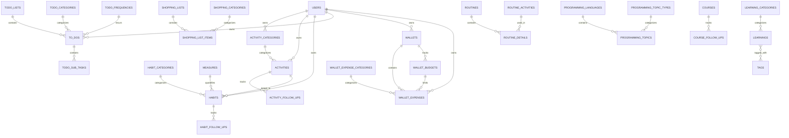

# Data Model - Complete Database Schema

## Database Architecture

The system uses **two separate MySQL databases**:
1. **Auth Database** (`jhp_auth_service_api`) - xavier-auth service
2. **Main Database** (`jhp_xavier_api`) - xavier-api service

---

# Auth Database Schema

## Users Table
```sql
CREATE TABLE users (
    id BIGINT UNSIGNED PRIMARY KEY AUTO_INCREMENT,
    name VARCHAR(255) NOT NULL,
    email VARCHAR(255) UNIQUE NOT NULL,
    email_verified_at TIMESTAMP NULL,
    is_account_verified BOOLEAN DEFAULT FALSE,
    auth_otp VARCHAR(255) NULL,
    last_otp_sent DATETIME NULL,
    password VARCHAR(255) NOT NULL,
    remember_token VARCHAR(100) NULL,
    created_at TIMESTAMP NULL,
    updated_at TIMESTAMP NULL,
    
    INDEX idx_email (email),
    INDEX idx_auth_otp (auth_otp)
);
```

**Relationships**:
- Has many `personal_access_tokens`
- Has many `refresh_tokens` (through personal_access_tokens)

**Business Rules**:
- Email must be unique
- OTP is 6 digits
- `is_account_verified` set to true after email verification
- `auth_otp` cleared after successful verification

---

## Personal Access Tokens (Laravel Sanctum)
```sql
CREATE TABLE personal_access_tokens (
    id BIGINT UNSIGNED PRIMARY KEY AUTO_INCREMENT,
    tokenable_type VARCHAR(255) NOT NULL,
    tokenable_id BIGINT UNSIGNED NOT NULL,
    name VARCHAR(255) NOT NULL,
    token VARCHAR(64) UNIQUE NOT NULL,
    abilities TEXT NULL,
    expires_at TIMESTAMP NULL,
    created_at TIMESTAMP NULL,
    updated_at TIMESTAMP NULL,
    
    INDEX idx_tokenable (tokenable_type, tokenable_id),
    INDEX idx_token (token)
);
```

**Business Rules**:
- `tokenable_type` = 'App\\Models\\User'
- `tokenable_id` = user.id
- Token is hashed (only plain text returned on creation)
- Expires_at used for token validation

---

## Refresh Tokens
```sql
CREATE TABLE refresh_tokens (
    id BIGINT UNSIGNED PRIMARY KEY AUTO_INCREMENT,
    token_id BIGINT UNSIGNED NOT NULL,
    plain_token VARCHAR(255) NOT NULL,
    created_at TIMESTAMP NULL,
    updated_at TIMESTAMP NULL,
    
    FOREIGN KEY (token_id) REFERENCES personal_access_tokens(id) ON DELETE CASCADE
);
```

**Business Rules**:
- Links to access token via `token_id`
- Used to generate new access tokens
- Expiration controlled by `REFRESH_EXPIRATION_DATE` env var (default: 43200 minutes = 30 days)

---

## Apps Table
```sql
CREATE TABLE apps (
    -- Structure unknown from migrations
    -- Needs clarification
);
```

---

# Main Database Schema

## User Management

### Users
```sql
CREATE TABLE users (
    id BIGINT UNSIGNED PRIMARY KEY AUTO_INCREMENT,
    email VARCHAR(255) UNIQUE NOT NULL,
    email_verified_at TIMESTAMP NULL,
    password VARCHAR(255) NOT NULL,
    auth_account INT NOT NULL,
    remember_token VARCHAR(100) NULL,
    created_at TIMESTAMP NULL,
    updated_at TIMESTAMP NULL,
    
    INDEX idx_auth_account (auth_account),
    INDEX idx_email (email)
);
```

**Relationships**:
- Has one `general_settings`
- Has many of almost all other tables

**Business Rules**:
- `auth_account` = user.id from auth database
- Minimal user data stored here
- Links to auth service for authentication

---

### General Settings
```sql
CREATE TABLE general_settings (
    id BIGINT UNSIGNED PRIMARY KEY AUTO_INCREMENT,
    user_id BIGINT UNSIGNED NOT NULL,
    -- Additional fields not fully examined
    created_at TIMESTAMP NULL,
    updated_at TIMESTAMP NULL,
    
    FOREIGN KEY (user_id) REFERENCES users(id) ON DELETE CASCADE
);
```

---

## Activities Domain

### Activity Categories
```sql
CREATE TABLE activity_categories (
    id CHAR(36) PRIMARY KEY, -- UUID
    order_index INT UNSIGNED DEFAULT 0,
    name VARCHAR(255) NOT NULL,
    color VARCHAR(255) NULL,
    description LONGTEXT NULL,
    icon VARCHAR(255) NULL,
    is_rest BOOLEAN DEFAULT FALSE,
    is_work BOOLEAN DEFAULT FALSE,
    is_learning BOOLEAN DEFAULT FALSE,
    is_self_care BOOLEAN DEFAULT FALSE,
    is_exercise BOOLEAN DEFAULT FALSE,
    is_driving BOOLEAN DEFAULT FALSE,
    is_entertainment BOOLEAN DEFAULT FALSE,
    is_feeding BOOLEAN DEFAULT FALSE,
    is_idle BOOLEAN DEFAULT FALSE,
    is_loving BOOLEAN DEFAULT FALSE,
    is_planning BOOLEAN DEFAULT FALSE,
    is_playing BOOLEAN DEFAULT FALSE,
    is_sleep BOOLEAN DEFAULT FALSE,
    user_id BIGINT UNSIGNED NOT NULL,
    created_at TIMESTAMP NULL,
    updated_at TIMESTAMP NULL,
    
    FOREIGN KEY (user_id) REFERENCES users(id) ON DELETE CASCADE,
    INDEX idx_user (user_id)
);
```

**Relationships**:
- Belongs to `user`
- Has many `activities`

**Business Rules**:
- Boolean flags categorize activity types
- User-owned and customizable
- `order_index` for user-defined sorting

---

### Activities
```sql
CREATE TABLE activities (
    id CHAR(36) PRIMARY KEY, -- UUID
    order_index BIGINT UNSIGNED DEFAULT 0,
    user_id BIGINT UNSIGNED NOT NULL,
    category_id CHAR(36) NOT NULL,
    name VARCHAR(255) NOT NULL,
    description LONGTEXT NULL,
    spent_time BIGINT UNSIGNED DEFAULT 0, -- Minutes
    created_at TIMESTAMP NULL,
    updated_at TIMESTAMP NULL,
    
    FOREIGN KEY (category_id) REFERENCES activity_categories(id) ON DELETE CASCADE,
    FOREIGN KEY (user_id) REFERENCES users(id) ON DELETE CASCADE,
    INDEX idx_user (user_id),
    INDEX idx_category (category_id)
);
```

**Relationships**:
- Belongs to `user`
- Belongs to `activity_category`
- Has many `activity_follow_ups`

**Business Rules**:
- `spent_time` accumulates from follow-ups (assumed)

---

### Activity Follow-Ups
```sql
CREATE TABLE activity_follow_ups (
    id CHAR(36) PRIMARY KEY, -- UUID
    user_id BIGINT UNSIGNED NOT NULL,
    activity_id CHAR(36) NOT NULL,
    date DATE NOT NULL,
    start_time TIME NULL,
    end_time TIME NULL,
    end_date DATE NULL, -- Added later
    duration INT UNSIGNED DEFAULT 0, -- Minutes
    notes LONGTEXT NULL,
    created_at TIMESTAMP NULL,
    updated_at TIMESTAMP NULL,
    
    FOREIGN KEY (activity_id) REFERENCES activities(id) ON DELETE CASCADE,
    FOREIGN KEY (user_id) REFERENCES users(id) ON DELETE CASCADE,
    INDEX idx_user_date (user_id, date),
    INDEX idx_activity (activity_id)
);
```

**Business Rules**:
- Time tracking entries for activities
- Can span multiple days (end_date)
- Duration calculated or manually entered

---

## Habits Domain

### Measures
```sql
CREATE TABLE measures (
    id CHAR(36) PRIMARY KEY, -- UUID
    order_index INT UNSIGNED DEFAULT 0,
    name VARCHAR(255) NOT NULL,
    abbreviation VARCHAR(255) NOT NULL,
    icon VARCHAR(255) NULL,
    type VARCHAR(255) NULL,
    user_id BIGINT UNSIGNED NOT NULL,
    created_at TIMESTAMP NULL,
    updated_at TIMESTAMP NULL,
    
    FOREIGN KEY (user_id) REFERENCES users(id) ON DELETE CASCADE,
    INDEX idx_user (user_id)
);
```

**Relationships**:
- Belongs to `user`
- Has many `habits`

**Business Rules**:
- Custom units (kg, reps, minutes, pages, etc.)
- User-defined

---

### Habit Categories
```sql
CREATE TABLE habit_categories (
    id CHAR(36) PRIMARY KEY, -- UUID
    order_index INT UNSIGNED DEFAULT 0,
    name VARCHAR(255) NOT NULL,
    description LONGTEXT NULL,
    icon VARCHAR(255) NULL,
    color VARCHAR(255) NULL,
    user_id BIGINT UNSIGNED NOT NULL,
    created_at TIMESTAMP NULL,
    updated_at TIMESTAMP NULL,
    
    FOREIGN KEY (user_id) REFERENCES users(id) ON DELETE CASCADE,
    INDEX idx_user (user_id)
);
```

---

### Habits
```sql
CREATE TABLE habits (
    id CHAR(36) PRIMARY KEY, -- UUID
    order_index INT UNSIGNED DEFAULT 0,
    name VARCHAR(255) NOT NULL,
    description LONGTEXT NULL,
    start_date DATE NULL,
    end_date DATE NULL,
    should_avoid BOOLEAN DEFAULT FALSE,
    should_keep BOOLEAN DEFAULT FALSE,
    is_counter BOOLEAN DEFAULT FALSE,
    is_timer BOOLEAN DEFAULT FALSE,
    is_incremental BOOLEAN DEFAULT FALSE,
    is_decremental BOOLEAN DEFAULT FALSE,
    days INT DEFAULT 0,
    streak INT DEFAULT 0,
    max_streak INT DEFAULT 0,
    daily_goal INT DEFAULT 0,
    timer_goal INT DEFAULT 0,
    times_goal INT DEFAULT 0,
    step INT NULL, -- Added later
    user_id BIGINT UNSIGNED NOT NULL,
    measure_id CHAR(36) NULL,
    activity_id CHAR(36) NULL,
    category_id CHAR(36) NOT NULL,
    created_at TIMESTAMP NULL,
    updated_at TIMESTAMP NULL,
    
    FOREIGN KEY (user_id) REFERENCES users(id) ON DELETE CASCADE,
    FOREIGN KEY (activity_id) REFERENCES activities(id) ON DELETE CASCADE,
    FOREIGN KEY (measure_id) REFERENCES measures(id) ON DELETE CASCADE,
    FOREIGN KEY (category_id) REFERENCES habit_categories(id) ON DELETE CASCADE,
    INDEX idx_user (user_id),
    INDEX idx_category (category_id)
);
```

**Relationships**:
- Belongs to `user`, `category`, `activity` (optional), `measure` (optional)
- Has many `habit_follow_ups`

**Business Rules**:
- Multiple tracking modes: counter, timer, incremental, decremental
- Streak tracking (current and max)
- `should_avoid` for habits to break, `should_keep` for habits to build
- Goals: daily_goal (quantity), timer_goal (minutes), times_goal (repetitions)

---

### Habit Follow-Ups
```sql
CREATE TABLE habit_follow_ups (
    id CHAR(36) PRIMARY KEY, -- UUID
    user_id BIGINT UNSIGNED NOT NULL,
    habit_id CHAR(36) NOT NULL,
    date DATE NOT NULL,
    count INT DEFAULT 0,
    time INT DEFAULT 0, -- Minutes
    notes LONGTEXT NULL,
    story LONGTEXT NULL, -- Added later
    archived BOOLEAN DEFAULT FALSE, -- Added later
    created_at TIMESTAMP NULL,
    updated_at TIMESTAMP NULL,
    
    FOREIGN KEY (habit_id) REFERENCES habits(id) ON DELETE CASCADE,
    FOREIGN KEY (user_id) REFERENCES users(id) ON DELETE CASCADE,
    INDEX idx_user_date (user_id, date),
    INDEX idx_habit (habit_id),
    INDEX idx_archived (archived)
);
```

**Business Rules**:
- Daily completion tracking
- `count` for counter-based habits
- `time` for timer-based habits
- `story` for journaling
- `archived` to hide old entries

---

## To-Do Domain

### To-Do Frequencies
```sql
CREATE TABLE todo_frequencies (
    id CHAR(36) PRIMARY KEY, -- UUID
    order_index INT UNSIGNED DEFAULT 0,
    name VARCHAR(255) NOT NULL,
    days INT DEFAULT 0, -- Recurrence in days
    user_id BIGINT UNSIGNED NOT NULL,
    created_at TIMESTAMP NULL,
    updated_at TIMESTAMP NULL,
    
    FOREIGN KEY (user_id) REFERENCES users(id) ON DELETE CASCADE,
    INDEX idx_user (user_id)
);
```

**Business Rules**:
- Defines recurrence patterns (e.g., "Daily" = 1, "Weekly" = 7)

---

### To-Do Categories
```sql
CREATE TABLE todo_categories (
    id CHAR(36) PRIMARY KEY, -- UUID
    order_index INT UNSIGNED DEFAULT 0,
    name VARCHAR(255) NOT NULL,
    description LONGTEXT NULL,
    icon VARCHAR(255) NULL,
    color VARCHAR(255) NULL,
    user_id BIGINT UNSIGNED NOT NULL,
    created_at TIMESTAMP NULL,
    updated_at TIMESTAMP NULL,
    
    FOREIGN KEY (user_id) REFERENCES users(id) ON DELETE CASCADE,
    INDEX idx_user (user_id)
);
```

---

### To-Do Lists
```sql
CREATE TABLE todo_lists (
    id CHAR(36) PRIMARY KEY, -- UUID
    order_index INT UNSIGNED DEFAULT 0,
    name VARCHAR(255) NOT NULL,
    description LONGTEXT NULL,
    icon VARCHAR(255) NULL,
    user_id BIGINT UNSIGNED NOT NULL,
    created_at TIMESTAMP NULL,
    updated_at TIMESTAMP NULL,
    
    FOREIGN KEY (user_id) REFERENCES users(id) ON DELETE CASCADE,
    INDEX idx_user (user_id)
);
```

---

### To-Dos
```sql
CREATE TABLE to_dos (
    id CHAR(36) PRIMARY KEY, -- UUID
    order_index INT UNSIGNED DEFAULT 0,
    title TEXT NOT NULL, -- Changed from VARCHAR to TEXT
    notes LONGTEXT NULL,
    is_done BOOLEAN DEFAULT FALSE,
    is_archived BOOLEAN DEFAULT FALSE,
    is_important BOOLEAN DEFAULT FALSE,
    is_today BOOLEAN DEFAULT FALSE, -- Added later
    is_this_week BOOLEAN DEFAULT FALSE, -- Added later
    application_date DATE NULL,
    frequency_id CHAR(36) NULL,
    category_id CHAR(36) NULL,
    list_id CHAR(36) NULL,
    user_id BIGINT UNSIGNED NOT NULL,
    created_at TIMESTAMP NULL,
    updated_at TIMESTAMP NULL,
    
    FOREIGN KEY (frequency_id) REFERENCES todo_frequencies(id) ON DELETE CASCADE,
    FOREIGN KEY (user_id) REFERENCES users(id) ON DELETE CASCADE,
    FOREIGN KEY (category_id) REFERENCES todo_categories(id) ON DELETE SET NULL,
    FOREIGN KEY (list_id) REFERENCES todo_lists(id) ON DELETE CASCADE,
    INDEX idx_user (user_id),
    INDEX idx_done (is_done),
    INDEX idx_important (is_important),
    INDEX idx_today (is_today),
    INDEX idx_this_week (is_this_week)
);
```

**Relationships**:
- Belongs to `user`, `frequency` (optional), `category` (optional), `list`
- Has many `todo_sub_tasks`

**Business Rules**:
- `is_today` and `is_this_week` flags for quick filtering
- `category_id` is nullable and cascades to null on delete

---

### To-Do Sub-Tasks
```sql
CREATE TABLE todo_sub_tasks (
    id CHAR(36) PRIMARY KEY, -- UUID
    order_index INT UNSIGNED DEFAULT 0,
    title VARCHAR(255) NOT NULL,
    is_done BOOLEAN DEFAULT FALSE,
    todo_id CHAR(36) NOT NULL,
    created_at TIMESTAMP NULL,
    updated_at TIMESTAMP NULL,
    
    FOREIGN KEY (todo_id) REFERENCES to_dos(id) ON DELETE CASCADE,
    INDEX idx_todo (todo_id)
);
```

---

## Wallet/Finance Domain

### Wallet Frequencies
```sql
CREATE TABLE wallet_frequencies (
    id CHAR(36) PRIMARY KEY, -- UUID
    order_index INT UNSIGNED DEFAULT 0,
    name VARCHAR(255) NOT NULL,
    days INT DEFAULT 0,
    frequency_type VARCHAR(255) NULL, -- Added later (daily, weekly, monthly, etc.)
    user_id BIGINT UNSIGNED NOT NULL,
    created_at TIMESTAMP NULL,
    updated_at TIMESTAMP NULL,
    
    FOREIGN KEY (user_id) REFERENCES users(id) ON DELETE CASCADE,
    INDEX idx_user (user_id)
);
```

---

### Wallet Expense Categories
```sql
CREATE TABLE wallet_expense_categories (
    id CHAR(36) PRIMARY KEY, -- UUID
    order_index INT UNSIGNED DEFAULT 0,
    name VARCHAR(255) NOT NULL,
    description LONGTEXT NULL,
    icon VARCHAR(255) NULL,
    color VARCHAR(255) NULL,
    is_transaction BOOLEAN DEFAULT FALSE, -- Added later
    user_id BIGINT UNSIGNED NOT NULL,
    created_at TIMESTAMP NULL,
    updated_at TIMESTAMP NULL,
    
    FOREIGN KEY (user_id) REFERENCES users(id) ON DELETE CASCADE,
    INDEX idx_user (user_id)
);
```

**Business Rules**:
- `is_transaction` flag for transfer categories vs expense categories

---

### Wallets
```sql
CREATE TABLE wallets (
    id CHAR(36) PRIMARY KEY, -- UUID
    order_index INT UNSIGNED DEFAULT 0,
    user_id BIGINT UNSIGNED NOT NULL,
    name VARCHAR(255) NOT NULL,
    icon VARCHAR(255) NULL,
    initial_balance DOUBLE DEFAULT 0,
    balance DOUBLE DEFAULT 0,
    is_main BOOLEAN DEFAULT FALSE,
    created_at TIMESTAMP NULL,
    updated_at TIMESTAMP NULL,
    
    FOREIGN KEY (user_id) REFERENCES users(id) ON DELETE CASCADE,
    INDEX idx_user (user_id),
    INDEX idx_main (is_main)
);
```

**Relationships**:
- Belongs to `user`
- Has many `wallet_expenses`, `wallet_scheduled_expenses`, `wallet_budgets`

**Business Rules**:
- Balance updated on expense create/update/delete
- `is_main` designates primary wallet

---

### Wallet Periods
```sql
CREATE TABLE wallet_periods (
    id CHAR(36) PRIMARY KEY, -- UUID
    order_index INT UNSIGNED DEFAULT 0,
    name VARCHAR(255) NOT NULL,
    start_date DATE NOT NULL,
    end_date DATE NOT NULL,
    user_id BIGINT UNSIGNED NOT NULL,
    created_at TIMESTAMP NULL,
    updated_at TIMESTAMP NULL,
    
    FOREIGN KEY (user_id) REFERENCES users(id) ON DELETE CASCADE,
    INDEX idx_user (user_id),
    INDEX idx_dates (start_date, end_date)
);
```

---

### Wallet Budgets
```sql
CREATE TABLE wallet_budgets (
    id CHAR(36) PRIMARY KEY, -- UUID
    name VARCHAR(255) NOT NULL,
    icon VARCHAR(255) NULL,
    description LONGTEXT NULL,
    amount DECIMAL(10, 2) NOT NULL,
    balance DECIMAL(10, 2) DEFAULT 0, -- Added later
    start_date DATE NOT NULL,
    end_date DATE NOT NULL,
    since DATE NULL, -- Added later
    is_active BOOLEAN DEFAULT TRUE,
    wallet_id CHAR(36) NOT NULL,
    frequency_id CHAR(36) NULL,
    user_id BIGINT UNSIGNED NOT NULL,
    created_at TIMESTAMP NULL,
    updated_at TIMESTAMP NULL,
    
    FOREIGN KEY (frequency_id) REFERENCES wallet_frequencies(id) ON DELETE CASCADE,
    FOREIGN KEY (wallet_id) REFERENCES wallets(id) ON DELETE CASCADE,
    FOREIGN KEY (user_id) REFERENCES users(id) ON DELETE CASCADE,
    INDEX idx_user (user_id),
    INDEX idx_active (is_active),
    INDEX idx_dates (start_date, end_date)
);
```

**Relationships**:
- Belongs to `user`, `wallet`, `frequency` (optional)
- Has many `wallet_expenses`, `wallet_budget_follow_ups`

**Business Rules**:
- `amount` is the budget limit
- `balance` tracks current spend (updated on expense create/update/delete)
- `since` tracks start date for tracking

---

### Wallet Budget Follow-Ups
```sql
CREATE TABLE budget_follow_ups (
    id CHAR(36) PRIMARY KEY, -- UUID
    budget_id CHAR(36) NOT NULL,
    closed_at DATE NOT NULL,
    final_balance DECIMAL(10, 2) NOT NULL,
    notes LONGTEXT NULL,
    created_at TIMESTAMP NULL,
    updated_at TIMESTAMP NULL,
    
    FOREIGN KEY (budget_id) REFERENCES wallet_budgets(id) ON DELETE CASCADE,
    INDEX idx_budget (budget_id)
);
```

**Business Rules**:
- Created when budget is closed
- Captures final state

---

### Wallet Expenses
```sql
CREATE TABLE wallet_expenses (
    id CHAR(36) PRIMARY KEY, -- UUID
    order_index INT UNSIGNED DEFAULT 0,
    date DATE NOT NULL,
    description TEXT NULL, -- Changed from VARCHAR to TEXT
    is_income BOOLEAN NOT NULL,
    is_outcome BOOLEAN NOT NULL,
    is_transaction BOOLEAN DEFAULT FALSE, -- Added later
    debit DOUBLE NOT NULL DEFAULT 0,
    credit DOUBLE NOT NULL DEFAULT 0,
    category_id CHAR(36) NOT NULL,
    wallet_id CHAR(36) NOT NULL,
    budget_id CHAR(36) NULL,
    expense_id CHAR(36) NULL, -- Added later (links to scheduled expense)
    user_id BIGINT UNSIGNED NOT NULL,
    created_at TIMESTAMP NULL,
    updated_at TIMESTAMP NULL,
    
    FOREIGN KEY (wallet_id) REFERENCES wallets(id) ON DELETE CASCADE,
    FOREIGN KEY (category_id) REFERENCES wallet_expense_categories(id) ON DELETE CASCADE,
    FOREIGN KEY (budget_id) REFERENCES wallet_budgets(id) ON DELETE SET NULL,
    FOREIGN KEY (user_id) REFERENCES users(id) ON DELETE CASCADE,
    INDEX idx_user (user_id),
    INDEX idx_date (date),
    INDEX idx_wallet (wallet_id),
    INDEX idx_budget (budget_id)
);
```

**Relationships**:
- Belongs to `user`, `wallet`, `category`, `budget` (optional)

**Business Rules**:
- `debit` = money in (income)
- `credit` = money out (expense)
- `is_income = debit > 0`
- `is_outcome = credit > 0`
- Updates wallet balance and budget balance on CRUD
- `is_transaction` for transfers between wallets
- `expense_id` links to scheduled expense if auto-generated

---

### Wallet Scheduled Expenses
```sql
CREATE TABLE wallet_scheduled_expenses (
    id CHAR(36) PRIMARY KEY, -- UUID
    order_index INT UNSIGNED DEFAULT 0,
    name VARCHAR(255) NOT NULL,
    description LONGTEXT NULL,
    amount DOUBLE NOT NULL,
    start_date DATE NOT NULL,
    end_date DATE NULL,
    frequency_id CHAR(36) NULL,
    wallet_id CHAR(36) NOT NULL,
    category_id CHAR(36) NOT NULL,
    budget_id CHAR(36) NULL, -- Added later
    is_income BOOLEAN DEFAULT FALSE, -- Added later
    paid BOOLEAN DEFAULT FALSE, -- Added later
    notes LONGTEXT NULL, -- Added later
    user_id BIGINT UNSIGNED NOT NULL,
    created_at TIMESTAMP NULL,
    updated_at TIMESTAMP NULL,
    
    FOREIGN KEY (wallet_id) REFERENCES wallets(id) ON DELETE CASCADE,
    FOREIGN KEY (category_id) REFERENCES wallet_expense_categories(id) ON DELETE CASCADE,
    FOREIGN KEY (frequency_id) REFERENCES wallet_frequencies(id) ON DELETE SET NULL,
    FOREIGN KEY (budget_id) REFERENCES wallet_budgets(id) ON DELETE SET NULL,
    FOREIGN KEY (user_id) REFERENCES users(id) ON DELETE CASCADE,
    INDEX idx_user (user_id),
    INDEX idx_dates (start_date, end_date)
);
```

**Business Rules**:
- Template for recurring expenses
- Auto-generation of actual expenses unclear (needs cron job?)
- `paid` flag to track if generated

---

## Shopping Domain

### Shopping Categories
```sql
CREATE TABLE shopping_categories (
    id CHAR(36) PRIMARY KEY, -- UUID
    order_index INT UNSIGNED DEFAULT 0,
    name VARCHAR(255) NOT NULL,
    description LONGTEXT NULL,
    icon VARCHAR(255) NULL,
    user_id BIGINT UNSIGNED NOT NULL,
    created_at TIMESTAMP NULL,
    updated_at TIMESTAMP NULL,
    
    FOREIGN KEY (user_id) REFERENCES users(id) ON DELETE CASCADE,
    INDEX idx_user (user_id)
);
```

---

### Shopping Lists
```sql
CREATE TABLE shopping_lists (
    id CHAR(36) PRIMARY KEY, -- UUID
    order_index INT UNSIGNED DEFAULT 0,
    name VARCHAR(255) NOT NULL,
    description VARCHAR(255) NULL,
    estimated_cost DOUBLE DEFAULT 0,
    cost DOUBLE DEFAULT 0,
    user_id BIGINT UNSIGNED NOT NULL,
    created_at TIMESTAMP NULL,
    updated_at TIMESTAMP NULL,
    
    FOREIGN KEY (user_id) REFERENCES users(id) ON DELETE CASCADE,
    INDEX idx_user (user_id)
);
```

**Business Rules**:
- `estimated_cost` vs `cost` tracking

---

### Shopping List Items
```sql
CREATE TABLE shopping_list_items (
    id CHAR(36) PRIMARY KEY, -- UUID
    order_index INT UNSIGNED DEFAULT 0,
    name VARCHAR(255) NOT NULL,
    quantity INT DEFAULT 1,
    price DOUBLE NULL,
    is_purchased BOOLEAN DEFAULT FALSE,
    list_id CHAR(36) NOT NULL,
    category_id CHAR(36) NULL,
    created_at TIMESTAMP NULL,
    updated_at TIMESTAMP NULL,
    
    FOREIGN KEY (list_id) REFERENCES shopping_lists(id) ON DELETE CASCADE,
    FOREIGN KEY (category_id) REFERENCES shopping_categories(id) ON DELETE SET NULL,
    INDEX idx_list (list_id),
    INDEX idx_purchased (is_purchased)
);
```

---

## Routines Domain

### Routine Activities
```sql
CREATE TABLE routine_activities (
    id CHAR(36) PRIMARY KEY, -- UUID
    order_index INT UNSIGNED DEFAULT 0,
    name VARCHAR(255) NOT NULL,
    description LONGTEXT NULL,
    icon VARCHAR(255) NULL,
    user_id BIGINT UNSIGNED NOT NULL,
    created_at TIMESTAMP NULL,
    updated_at TIMESTAMP NULL,
    
    FOREIGN KEY (user_id) REFERENCES users(id) ON DELETE CASCADE,
    INDEX idx_user (user_id)
);
```

**Business Rules**:
- Reusable activity templates for routines

---

### Routines
```sql
CREATE TABLE routines (
    id CHAR(36) PRIMARY KEY, -- UUID
    order_index INT UNSIGNED DEFAULT 0,
    name VARCHAR(255) NOT NULL,
    description LONGTEXT NULL,
    is_active BOOLEAN DEFAULT FALSE,
    icon VARCHAR(255) NULL,
    user_id BIGINT UNSIGNED NOT NULL,
    created_at TIMESTAMP NULL,
    updated_at TIMESTAMP NULL,
    
    FOREIGN KEY (user_id) REFERENCES users(id) ON DELETE CASCADE,
    INDEX idx_user (user_id),
    INDEX idx_active (is_active)
);
```

**Business Rules**:
- Only one routine can be active at a time (assumed)

---

### Routine Details
```sql
CREATE TABLE routine_details (
    id CHAR(36) PRIMARY KEY, -- UUID
    order_index INT UNSIGNED DEFAULT 0,
    routine_id CHAR(36) NOT NULL,
    routine_activity_id CHAR(36) NOT NULL,
    duration INT DEFAULT 0, -- Minutes
    start_date DATE NULL, -- Added later
    created_at TIMESTAMP NULL,
    updated_at TIMESTAMP NULL,
    
    FOREIGN KEY (routine_id) REFERENCES routines(id) ON DELETE CASCADE,
    FOREIGN KEY (routine_activity_id) REFERENCES routine_activities(id),
    INDEX idx_routine (routine_id)
);
```

**Business Rules**:
- Links activities to routines with specific duration

---

## Learning Domain

### Learning Categories
```sql
CREATE TABLE learning_categories (
    id CHAR(36) PRIMARY KEY, -- UUID
    order_index INT UNSIGNED DEFAULT 0,
    name VARCHAR(255) NOT NULL,
    description LONGTEXT NULL,
    icon VARCHAR(255) NULL,
    user_id BIGINT UNSIGNED NOT NULL,
    created_at TIMESTAMP NULL,
    updated_at TIMESTAMP NULL,
    
    FOREIGN KEY (user_id) REFERENCES users(id) ON DELETE CASCADE,
    INDEX idx_user (user_id)
);
```

---

### Learning Resources
```sql
CREATE TABLE learnings (
    id CHAR(36) PRIMARY KEY, -- UUID
    order_index INT UNSIGNED DEFAULT 0,
    title VARCHAR(255) NOT NULL,
    description LONGTEXT NULL,
    url LONGTEXT NULL,
    category_id CHAR(36) NOT NULL,
    user_id BIGINT UNSIGNED NOT NULL,
    created_at TIMESTAMP NULL,
    updated_at TIMESTAMP NULL,
    
    FOREIGN KEY (category_id) REFERENCES learning_categories(id) ON DELETE CASCADE,
    FOREIGN KEY (user_id) REFERENCES users(id) ON DELETE CASCADE,
    INDEX idx_user (user_id),
    INDEX idx_category (category_id)
);
```

---

### Tags
```sql
CREATE TABLE tags (
    id CHAR(36) PRIMARY KEY, -- UUID
    order_index INT UNSIGNED DEFAULT 0,
    name VARCHAR(255) NOT NULL,
    color VARCHAR(255) NULL,
    user_id BIGINT UNSIGNED NOT NULL,
    created_at TIMESTAMP NULL,
    updated_at TIMESTAMP NULL,
    
    FOREIGN KEY (user_id) REFERENCES users(id) ON DELETE CASCADE,
    INDEX idx_user (user_id)
);
```

---

### Learning Tag (Pivot)
```sql
CREATE TABLE learning_tag (
    learning_id CHAR(36) NOT NULL,
    tag_id CHAR(36) NOT NULL,
    
    PRIMARY KEY (learning_id, tag_id),
    FOREIGN KEY (learning_id) REFERENCES learnings(id) ON DELETE CASCADE,
    FOREIGN KEY (tag_id) REFERENCES tags(id) ON DELETE CASCADE
);
```

---

## Programming Domain

### Programming Languages
```sql
CREATE TABLE programming_languages (
    id CHAR(36) PRIMARY KEY, -- UUID
    order_index INT UNSIGNED DEFAULT 0,
    name VARCHAR(255) NOT NULL,
    description LONGTEXT NULL,
    icon VARCHAR(255) NULL,
    user_id BIGINT UNSIGNED NOT NULL,
    created_at TIMESTAMP NULL,
    updated_at TIMESTAMP NULL,
    
    FOREIGN KEY (user_id) REFERENCES users(id) ON DELETE CASCADE,
    INDEX idx_user (user_id)
);
```

---

### Programming Topic Types
```sql
CREATE TABLE programming_topic_types (
    id CHAR(36) PRIMARY KEY, -- UUID
    order_index INT UNSIGNED DEFAULT 0,
    name VARCHAR(255) NOT NULL,
    description LONGTEXT NULL,
    user_id BIGINT UNSIGNED NOT NULL,
    created_at TIMESTAMP NULL,
    updated_at TIMESTAMP NULL,
    
    FOREIGN KEY (user_id) REFERENCES users(id) ON DELETE CASCADE,
    INDEX idx_user (user_id)
);
```

**Examples**: Framework, Library, Concept, Tool

---

### Programming Topics
```sql
CREATE TABLE programming_topics (
    id CHAR(36) PRIMARY KEY, -- UUID
    order_index INT UNSIGNED DEFAULT 0,
    name VARCHAR(255) NOT NULL,
    description LONGTEXT NULL,
    language_id CHAR(36) NOT NULL,
    type_id CHAR(36) NOT NULL,
    user_id BIGINT UNSIGNED NOT NULL,
    created_at TIMESTAMP NULL,
    updated_at TIMESTAMP NULL,
    
    FOREIGN KEY (language_id) REFERENCES programming_languages(id) ON DELETE CASCADE,
    FOREIGN KEY (type_id) REFERENCES programming_topic_types(id) ON DELETE CASCADE,
    FOREIGN KEY (user_id) REFERENCES users(id) ON DELETE CASCADE,
    INDEX idx_user (user_id),
    INDEX idx_language (language_id)
);
```

---

## Courses Domain

### Courses
```sql
CREATE TABLE courses (
    id CHAR(36) PRIMARY KEY, -- UUID
    title VARCHAR(255) NOT NULL,
    description LONGTEXT NULL,
    url LONGTEXT NULL,
    lessons INT DEFAULT 0,
    completed_lessons INT DEFAULT 0,
    percentage INT DEFAULT 0,
    user_id BIGINT UNSIGNED NOT NULL,
    created_at TIMESTAMP NULL,
    updated_at TIMESTAMP NULL,
    
    FOREIGN KEY (user_id) REFERENCES users(id) ON DELETE CASCADE,
    INDEX idx_user (user_id)
);
```

**Business Rules**:
- `percentage = (completed_lessons / lessons) * 100`

---

### Course Follow-Ups
```sql
CREATE TABLE course_follow_ups (
    id CHAR(36) PRIMARY KEY, -- UUID
    course_id CHAR(36) NOT NULL,
    date DATE NOT NULL,
    lessons_completed INT NOT NULL,
    notes LONGTEXT NULL,
    created_at TIMESTAMP NULL,
    updated_at TIMESTAMP NULL,
    
    FOREIGN KEY (course_id) REFERENCES courses(id) ON DELETE CASCADE,
    INDEX idx_course (course_id),
    INDEX idx_date (date)
);
```

---

## Sleep Tracking Domain

### Sleep Follow-Ups
```sql
CREATE TABLE sleep_follow_ups (
    id CHAR(36) PRIMARY KEY, -- UUID
    user_id BIGINT UNSIGNED NOT NULL,
    date DATE NOT NULL,
    hours INT NOT NULL DEFAULT 0,
    minutes INT NOT NULL DEFAULT 0,
    quality INT NULL, -- 1-5 scale
    notes LONGTEXT NULL,
    created_at TIMESTAMP NULL,
    updated_at TIMESTAMP NULL,
    
    FOREIGN KEY (user_id) REFERENCES users(id) ON DELETE CASCADE,
    INDEX idx_user (user_id),
    INDEX idx_date (date),
    UNIQUE KEY unique_user_date (user_id, date)
);
```

---

## Entity Relationship Summary



---

## Indexes Strategy

### Current State
- Primary keys on all tables (id)
- Foreign keys with indexes
- User_id indexed on most tables
- Date fields indexed on time-series data

### Missing Indexes (Performance Opportunities)
- Composite indexes on (user_id, date) for follow-up tables
- Full-text search indexes on description/notes fields
- Covering indexes for common query patterns

---

## Data Integrity Rules

1. **Cascade Deletes**: Most foreign keys cascade on delete (user deletion removes all data)
2. **Set Null**: Category deletions in some tables set FK to null
3. **UUID Primary Keys**: All domain entities use UUID (CHAR(36))
4. **Auto-Increment**: Only users table uses auto-increment
5. **Timestamps**: All tables have created_at, updated_at
6. **Soft Deletes**: Not implemented
7. **Balance Consistency**: Wallet and budget balances must match transaction history

---

## Migration Strategy Notes

- **Schema Evolution**: Multiple ALTER TABLE migrations show iterative development
- **Field Type Changes**: Some VARCHAR changed to TEXT (title, description)
- **Added Features**: Flags like is_today, is_transaction added later
- **Nullability Changes**: Some FKs made nullable for flexibility

---

## Total Table Count

- **Auth Database**: 4 tables
- **Main Database**: 50+ tables
- **Pivot Tables**: 1 (learning_tag)
- **Total**: ~54 tables
