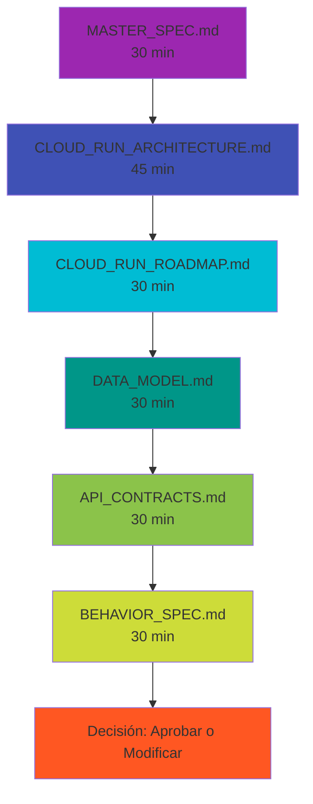
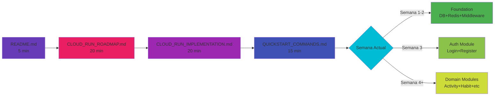
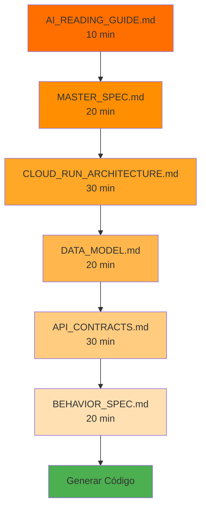

# 📖 Guía de Lectura Visual - Cloud Run Implementation

## 🎯 Camino Rápido (Para Empezar YA) - 30 minutos


**Para**: Quiero empezar a codear YA

1. **[CLOUD_RUN_SUMMARY.md](./CLOUD_RUN_SUMMARY.md)** (5 min) - ¿Qué se añadió?
2. **[QUICKSTART_COMMANDS.md](./QUICKSTART_COMMANDS.md)** (10 min) - Copia y pega comandos
3. **[CLOUD_RUN_IMPLEMENTATION.md](./CLOUD_RUN_IMPLEMENTATION.md)** (15 min) - Copia código base

---

## 🏗️ Camino Completo (Para Arquitectos) - 3 horas



**Para**: Necesito entender TODO antes de aprobar

1. **[MASTER_SPEC.md](./MASTER_SPEC.md)** - Visión general del proyecto
2. **[CLOUD_RUN_ARCHITECTURE.md](./CLOUD_RUN_ARCHITECTURE.md)** - Arquitectura técnica completa
3. **[CLOUD_RUN_ROADMAP.md](./CLOUD_RUN_ROADMAP.md)** - Plan de implementación
4. **[DATA_MODEL.md](./DATA_MODEL.md)** - Esquema de base de datos
5. **[API_CONTRACTS.md](./API_CONTRACTS.md)** - Todos los endpoints
6. **[BEHAVIOR_SPEC.md](./BEHAVIOR_SPEC.md)** - Lógica de negocio

---

## 💻 Camino del Implementador (Para Developers) - 1 hora



**Para**: Voy a implementar el sistema semana a semana

1. **[README.md](./README.md)** - Orientación general
2. **[CLOUD_RUN_ROADMAP.md](./CLOUD_RUN_ROADMAP.md)** - Plan de 10 semanas
3. **[CLOUD_RUN_IMPLEMENTATION.md](./CLOUD_RUN_IMPLEMENTATION.md)** - Código base
4. **[QUICKSTART_COMMANDS.md](./QUICKSTART_COMMANDS.md)** - Setup inicial

**Luego, según la semana actual**:

- **Semanas 1-2**: Foundation → Copia código de CLOUD_RUN_IMPLEMENTATION.md
- **Semana 3**: Auth → Referencia API_CONTRACTS.md (endpoints auth)
- **Semana 4+**: Dominios → Referencia API_CONTRACTS.md + BEHAVIOR_SPEC.md

---

## 🤖 Camino para IA (GitHub Copilot/ChatGPT) - 2 horas



**Para**: Usar IA para generar código automáticamente

1. **[AI_READING_GUIDE.md](./AI_READING_GUIDE.md)** - Cómo alimentar a la IA
2. **[MASTER_SPEC.md](./MASTER_SPEC.md)** - Contexto general
3. **[CLOUD_RUN_ARCHITECTURE.md](./CLOUD_RUN_ARCHITECTURE.md)** - Patrones arquitectónicos
4. **[DATA_MODEL.md](./DATA_MODEL.md)** - Schema completo
5. **[API_CONTRACTS.md](./API_CONTRACTS.md)** - Request/Response
6. **[BEHAVIOR_SPEC.md](./BEHAVIOR_SPEC.md)** - Validaciones y lógica

---

## 📊 Documentos por Categoría

### 🟢 Cloud Run Específicos (NUEVOS)

| Documento                          | Propósito             | Tiempo de Lectura |
| ---------------------------------- | --------------------- | ----------------- |
| **CLOUD_RUN_ARCHITECTURE.md** ⭐   | Arquitectura completa | 45 min            |
| **CLOUD_RUN_IMPLEMENTATION.md** ⭐ | Código de ejemplo     | 20 min            |
| **CLOUD_RUN_ROADMAP.md** ⭐        | Plan de 10 semanas    | 30 min            |
| **QUICKSTART_COMMANDS.md** 🚀      | Comandos copy-paste   | 15 min            |
| **CLOUD_RUN_SUMMARY.md** 📋        | Resumen de cambios    | 5 min             |

### 🔵 Documentos Fundamentales

| Documento            | Propósito         | Tiempo de Lectura |
| -------------------- | ----------------- | ----------------- |
| **README.md**        | Navegación        | 5 min             |
| **MASTER_SPEC.md**   | Overview completo | 30 min            |
| **DATA_MODEL.md**    | Esquema DB        | 30 min            |
| **API_CONTRACTS.md** | Endpoints         | 45 min            |
| **BEHAVIOR_SPEC.md** | Lógica de negocio | 30 min            |

### 🟡 Documentos de Referencia

| Documento                             | Propósito                 | Tiempo de Lectura |
| ------------------------------------- | ------------------------- | ----------------- |
| **SYSTEM_MAP.md**                     | Sistema actual (Laravel)  | 20 min            |
| **TARGET_ARCHITECTURE.md**            | Alternativa multi-función | 30 min            |
| **ROUTING_AND_FUNCTIONS.md**          | Mapeo de rutas            | 15 min            |
| **IMPLEMENTATION_BLUEPRINT_PART1.md** | Setup general             | 15 min            |

### 🟠 Documentos Auxiliares

| Documento                           | Propósito        | Tiempo de Lectura |
| ----------------------------------- | ---------------- | ----------------- |
| **AI_READING_GUIDE.md**             | Para usar con IA | 10 min            |
| **STEP1_PROJECT_IDENTIFICATION.md** | Análisis inicial | 15 min            |
| **COMPLETION_SUMMARY.md**           | Qué se completó  | 5 min             |

---

## 🎯 Por Rol / Objetivo

### Si eres... Project Manager

```
📖 Leer:
1. CLOUD_RUN_SUMMARY.md (5 min) - Entender qué hay
2. MASTER_SPEC.md (30 min) - Overview completo
3. CLOUD_RUN_ROADMAP.md (30 min) - Timeline y costos

✅ Suficiente para: Aprobar proyecto, asignar recursos, estimar costos
```

### Si eres... Tech Lead / Arquitecto

```
📖 Leer:
1. MASTER_SPEC.md (30 min)
2. CLOUD_RUN_ARCHITECTURE.md (45 min) ⭐
3. DATA_MODEL.md (30 min)
4. API_CONTRACTS.md (45 min)
5. BEHAVIOR_SPEC.md (30 min)

✅ Suficiente para: Validar decisiones técnicas, revisar arquitectura
```

### Si eres... Backend Developer

```
📖 Leer:
1. README.md (5 min)
2. CLOUD_RUN_ROADMAP.md (30 min) ⭐
3. CLOUD_RUN_IMPLEMENTATION.md (20 min) ⭐
4. QUICKSTART_COMMANDS.md (15 min) ⭐

📄 Referencias durante dev:
- API_CONTRACTS.md (cuando implementes endpoints)
- DATA_MODEL.md (cuando escribas queries)
- BEHAVIOR_SPEC.md (cuando implementes lógica)

✅ Suficiente para: Empezar a codear inmediatamente
```

### Si eres... DevOps Engineer

```
📖 Leer:
1. CLOUD_RUN_ARCHITECTURE.md (45 min) - Sección Infrastructure
2. QUICKSTART_COMMANDS.md (15 min) - Setup GCP
3. CLOUD_RUN_ROADMAP.md (30 min) - Fase 6: Deployment

💻 Copiar:
- Terraform completo de CLOUD_RUN_ARCHITECTURE.md
- cloudbuild.yaml de CLOUD_RUN_ARCHITECTURE.md
- GitHub Actions de CLOUD_RUN_ARCHITECTURE.md

✅ Suficiente para: Crear toda la infraestructura y CI/CD
```

### Si eres... QA / Tester

```
📖 Leer:
1. API_CONTRACTS.md (45 min) - Todos los endpoints
2. BEHAVIOR_SPEC.md (30 min) - Casos de uso
3. CLOUD_RUN_ROADMAP.md (30 min) - Fase 5: Testing

✅ Suficiente para: Crear plan de pruebas, escribir test cases
```

---

## 🚀 Flujo de Implementación Sugerido

### Día 1: Setup (2 horas)

```
[ ] Leer CLOUD_RUN_SUMMARY.md
[ ] Leer QUICKSTART_COMMANDS.md
[ ] Ejecutar comandos de setup GCP
[ ] Crear infraestructura con Terraform
[ ] Verificar que todo funciona
```

### Día 2-3: Foundation (8 horas)

```
[ ] Leer CLOUD_RUN_IMPLEMENTATION.md
[ ] Copiar estructura de proyecto
[ ] Implementar src/server.ts
[ ] Implementar src/app.ts
[ ] Implementar database pool
[ ] Implementar Redis client
[ ] Implementar middleware de auth
[ ] Deploy a Cloud Run Dev
```

### Semana 2: Auth Module (20 horas)

```
[ ] Referencia: API_CONTRACTS.md sección Auth
[ ] Referencia: BEHAVIOR_SPEC.md UC-1, UC-2, UC-3
[ ] Implementar migraciones de usuarios
[ ] Implementar controladores de auth
[ ] Escribir tests
[ ] Deploy y verificar
```

### Semanas 3-7: Domain Modules (100 horas)

```
Para cada módulo:
[ ] Leer API_CONTRACTS.md (endpoints del módulo)
[ ] Leer BEHAVIOR_SPEC.md (casos de uso)
[ ] Crear migraciones
[ ] Implementar controladores
[ ] Escribir tests
[ ] Deploy a dev
```

### Semana 8: Testing & Optimization (20 horas)

```
[ ] Seguir CLOUD_RUN_ROADMAP.md Fase 5
[ ] Tests de integración
[ ] Tests E2E
[ ] Load testing
[ ] Optimización
```

### Semanas 9-10: Production (20 horas)

```
[ ] Seguir CLOUD_RUN_ROADMAP.md Fase 6
[ ] Setup production infrastructure
[ ] CI/CD
[ ] Deploy a producción
[ ] Migración de datos
[ ] Monitoring
```

---

## 📋 Checklist de Documentación Leída

### Mínimo Viable (Empezar a codear)

- [ ] CLOUD_RUN_SUMMARY.md
- [ ] QUICKSTART_COMMANDS.md
- [ ] CLOUD_RUN_IMPLEMENTATION.md

### Recomendado (Entender bien)

- [ ] MASTER_SPEC.md
- [ ] CLOUD_RUN_ARCHITECTURE.md
- [ ] CLOUD_RUN_ROADMAP.md
- [ ] API_CONTRACTS.md
- [ ] DATA_MODEL.md

### Completo (Dominar proyecto)

- [ ] Todos los anteriores
- [ ] BEHAVIOR_SPEC.md
- [ ] SYSTEM_MAP.md
- [ ] AI_READING_GUIDE.md

---

## 🎨 Mapa Mental del Proyecto

```
Xavier Platform (Cloud Run)
│
├── 📚 Documentación
│   ├── 🟢 Cloud Run Específica (5 docs) ⭐
│   ├── 🔵 Especificaciones Core (5 docs)
│   ├── 🟡 Referencia (4 docs)
│   └── 🟠 Auxiliares (3 docs)
│
├── 🏗️ Arquitectura
│   ├── Google Cloud Run (contenedor único)
│   ├── Cloud SQL PostgreSQL (54 tablas)
│   ├── Memorystore Redis (cache)
│   ├── Cloud Tasks (email queue)
│   └── Secret Manager (credenciales)
│
├── 💻 Implementación
│   ├── Node.js 18 + TypeScript 5
│   ├── Express.js (HTTP server)
│   ├── Docker (contenedor)
│   └── Terraform (IaC)
│
├── 📡 API
│   ├── 150+ endpoints REST
│   ├── 10 dominios (Auth, Activity, Habit, etc.)
│   └── JWT authentication
│
├── 🗄️ Base de Datos
│   ├── 54 tablas
│   ├── PostgreSQL 15
│   └── Migraciones SQL
│
└── 🚀 Deploy
    ├── CI/CD (Cloud Build / GitHub Actions)
    ├── Dev → Staging → Prod
    └── Monitoring (Cloud Logging/Monitoring)
```

---

## 💡 Tips Finales

### Para leer eficientemente:

1. **No leas todo secuencialmente** - Usa los caminos sugeridos arriba
2. **Marca con ⭐ los docs críticos** para tu rol
3. **Usa Ctrl+F** para buscar conceptos específicos
4. **Ten abiertos 2-3 docs a la vez** para referencias cruzadas

### Para implementar eficientemente:

1. **Sigue CLOUD_RUN_ROADMAP.md al pie de la letra**
2. **Copia código de CLOUD_RUN_IMPLEMENTATION.md** (no reinventes)
3. **Consulta API_CONTRACTS.md constantemente** (verdad única)
4. **Usa QUICKSTART_COMMANDS.md** (comandos probados)

### Para consultar durante desarrollo:

- Duda de arquitectura → **CLOUD_RUN_ARCHITECTURE.md**
- Duda de endpoint → **API_CONTRACTS.md**
- Duda de base de datos → **DATA_MODEL.md**
- Duda de lógica → **BEHAVIOR_SPEC.md**
- Duda de comando → **QUICKSTART_COMMANDS.md**

---

**Total de documentación**: 18 archivos  
**Nuevos para Cloud Run**: 5 archivos ⭐  
**Tiempo de lectura completa**: ~6 horas  
**Tiempo mínimo para empezar**: ~30 minutos

**Estado**: 100% Completo para Cloud Run ✅
