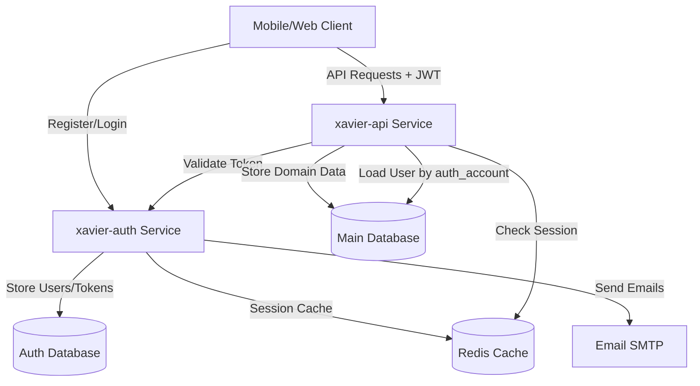
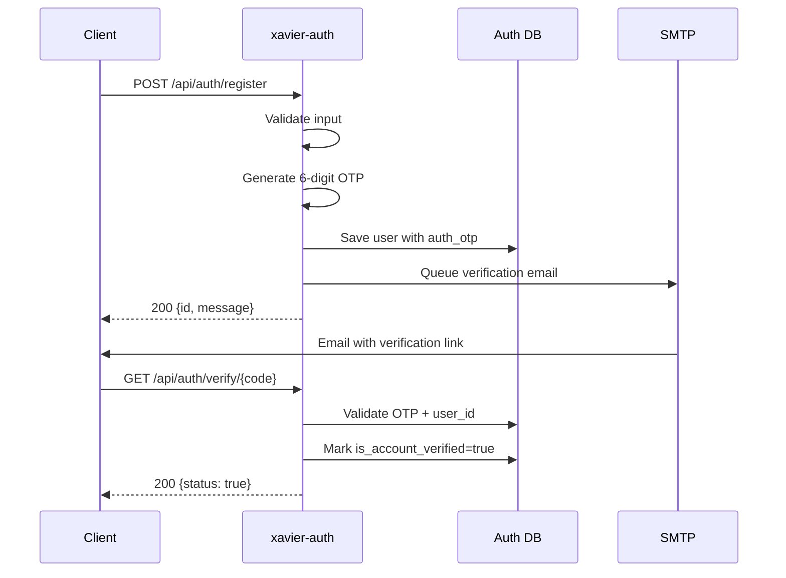
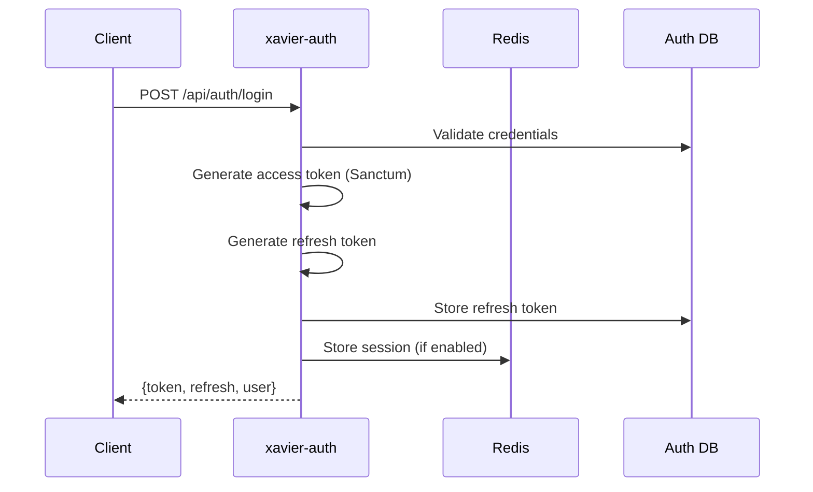
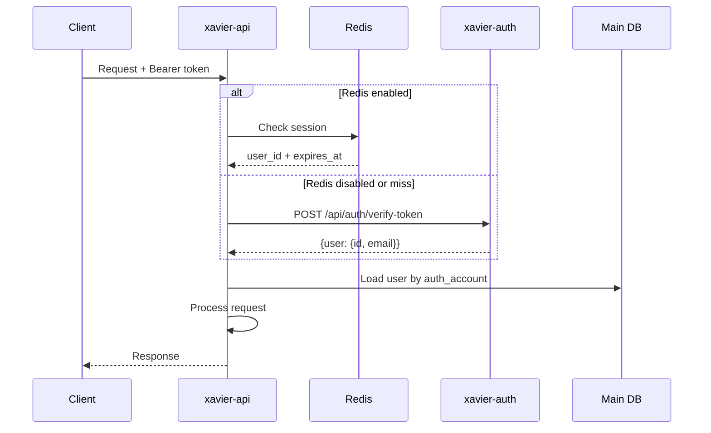

# System Map (As-Is Architecture)

## Architecture Overview



## System Components

### 1. xavier-auth (Authentication Service)
**Technology**: Laravel 10 + PHP 8.1  
**Port**: 8000  
**Database**: MySQL (jhp_auth_service_api)

**Responsibilities**:
- User registration with email verification
- User authentication (login)
- JWT token generation and validation
- Token refresh mechanism
- Session management (Redis-backed)

### 2. xavier-api (Main Application API)
**Technology**: Laravel 10 + PHP 8.1  
**Port**: 8001  
**Database**: MySQL (jhp_xavier_api)

**Responsibilities**:
- All business logic for productivity features
- Data persistence for user activities
- Authorization via token validation
- Multi-domain CRUD operations

### 3. Supporting Infrastructure
- **Redis**: Session caching, auth token storage
- **MySQL**: Persistent data storage (2 separate databases)
- **SMTP**: Email delivery (verification, notifications)

---

## Data Stores

### Auth Database (xavier-auth)
**Tables**:
1. **users**
   - id (bigint, PK)
   - name (string)
   - email (string, unique)
   - password (hashed)
   - email_verified_at (timestamp, nullable)
   - is_account_verified (boolean)
   - auth_otp (string, nullable) - 6-digit verification code
   - last_otp_sent (datetime, nullable)
   - timestamps

2. **refresh_tokens**
   - id (bigint, PK)
   - token_id (bigint) - references Sanctum personal_access_tokens
   - plain_token (string)
   - timestamps

3. **personal_access_tokens** (Laravel Sanctum)
   - id (bigint, PK)
   - tokenable_type (string)
   - tokenable_id (bigint)
   - name (string)
   - token (string, hashed)
   - abilities (text)
   - expires_at (timestamp)
   - timestamps

4. **apps** (Purpose unknown - needs clarification)
   - Structure not examined

### Main Database (xavier-api)

**Core Tables** (50+ tables organized by domain):

#### User Management
- **users**: Minimal user record with auth_account linking to auth service
  - Columns: id, email, password, auth_account (links to auth service), timestamps

#### Activities Domain
- **activity_categories**: Categories for time-tracking activities (work, rest, learning, etc.)
- **activities**: Individual activities with spent time tracking
- **activity_follow_ups**: Time entries for activities with start/end timestamps

#### Habits Domain
- **habit_categories**: Categories for habits
- **habits**: Habit definitions with goals, streaks, timers
- **habit_follow_ups**: Daily habit completions with notes, stories
- **measures**: Custom units for habit tracking (kg, reps, minutes, etc.)

#### To-Do Domain
- **todo_frequencies**: Recurring patterns for tasks
- **todo_categories**: Categories for organizing todos
- **todo_lists**: Named lists to group todos
- **to_dos**: Tasks with title, notes, done status, importance flags
- **todo_sub_tasks**: Sub-items under main todos

#### Wallet/Finance Domain
- **wallets**: Financial accounts with balance tracking
- **wallet_expense_categories**: Categories for expenses (income, food, transport, etc.)
- **wallet_expenses**: Individual transactions (debit/credit)
- **wallet_scheduled_expenses**: Recurring expenses
- **wallet_budgets**: Budget limits for periods
- **wallet_budget_follow_ups**: Budget closure tracking
- **wallet_periods**: Time periods for budget grouping
- **wallet_frequencies**: Recurrence patterns for scheduled expenses

#### Shopping Domain
- **shopping_categories**: Product categories
- **shopping_lists**: Shopping list headers
- **shopping_list_items**: Items in shopping lists with prices

#### Routines Domain
- **routines**: Daily/weekly routine templates
- **routine_activities**: Activities that can be added to routines
- **routine_details**: Specific activities in a routine with duration

#### Learning Domain
- **learning_categories**: Categories for learning resources
- **learnings**: Learning resources (books, articles, videos)
- **tags**: Tags for categorization
- **learning_tag**: Pivot table for many-to-many relationship

#### Programming Domain
- **programming_languages**: Languages being learned
- **programming_topic_types**: Types of topics (framework, library, concept)
- **programming_topics**: Specific topics per language

#### Courses Domain
- **courses**: Online courses with progress tracking
- **course_follow_ups**: Daily progress entries for courses

#### Sleep Tracking
- **sleep_follow_ups**: Sleep tracking entries with duration

#### Settings
- **general_settings**: User preferences and settings

---

## Integration Points

### External Service Calls

#### xavier-api → xavier-auth
**Purpose**: Token validation  
**Endpoint**: `POST {EXTERNAL_AUTH_SERVICE_DOMAIN}/api/auth/verify-token`  
**Payload**:
```json
{
  "token": "string"
}
```
**Response**:
```json
{
  "status": true,
  "data": {
    "user": {
      "id": 123,
      "email": "user@example.com",
      "name": "User Name"
    }
  }
}
```
**Fallback**: Redis session cache lookup

#### xavier-auth → Email SMTP
**Purpose**: Send verification emails  
**Trigger**: User registration, resend verification  
**Email Type**: `AccountVerification` mail class  
**Queue**: Queued (async)

### Redis Integration

**Purpose**: Performance optimization for auth lookups

**Keys Structure**:
```
{REDIS_AUTH_PREFIX}sessions:{token} → user_id
{REDIS_AUTH_PREFIX}user-sessions:{user_id} → JSON({token: {expires_at: timestamp}})
```

**Flow**:
1. On login, store token → user mapping in Redis
2. On API request, check Redis first before HTTP call
3. Validate expiration timestamp
4. If expired or missing, fall back to HTTP validation

---

## Security Model

### Authentication Flow

#### Registration Flow


#### Login Flow


#### API Request Flow


### Token Strategy
- **Access Token**: Laravel Sanctum Personal Access Token
  - Stored in `personal_access_tokens` table
  - Includes expiration timestamp
  - Sent in `Authorization: Bearer {token}` header
- **Refresh Token**: Custom implementation
  - Stored in `refresh_tokens` table
  - Linked to access token via `token_id`
  - Used to generate new access token
  - Expiration: 43200 minutes (30 days) - configurable

### Authorization Model
**Middleware**: `AuthService` (in xavier-api)  
**Strategy**:
1. Extract bearer token from request
2. Validate token (Redis or HTTP)
3. Load user from local database by `auth_account`
4. Attach user to request context

**Resource Ownership**: `owner` middleware  
- Validates that resource belongs to authenticated user
- Applied to update/delete operations
- Route binding: `owner:resource_name`

### Roles/Permissions
**Current State**: No role-based access control (RBAC) detected  
**Access Model**: User-owned resources only  
**Implication**: Each user can only access their own data

---

## Error Handling Patterns

### Standard Error Response Format
```json
{
  "status": false,
  "message": "Error description",
  "errors": ["array of error messages"],
  "env": "local|production"
}
```

### Common HTTP Status Codes
- **200**: Success
- **401**: Unauthorized (invalid/missing token, expired token)
- **404**: Resource not found
- **400**: Validation errors
- **500**: Server errors (uncaught exceptions)

### Token Expiration Handling
```json
{
  "status": false,
  "expired": true,
  "message": "Expired token"
}
```
**Client Action**: Use refresh token to get new access token

---

## Background Jobs & Cron

### Detected Queue Jobs
1. **Email Verification**: `Mail::queue(new AccountVerification($user))`
   - Triggered on registration and resend
   - Queue: Default
   - Driver: Configurable (sync, database, redis)

### Cron Jobs
**Status**: Not detected in codebase  
**Potential Needs**:
- Cleanup expired tokens
- Generate scheduled expenses
- Send reminder notifications

---

## Observability

### Logging
**Framework**: Laravel Log  
**Channels**: Stack (configurable)  
**Level**: Configurable via `LOG_LEVEL` env var  
**Default**: Stored in `storage/logs/laravel.log`

### Metrics
**Status**: No metrics instrumentation detected  
**Missing**: Prometheus, StatsD, or custom metrics

### Traces
**Status**: No distributed tracing detected  
**Missing**: OpenTelemetry, Jaeger, or similar

### Alerts
**Status**: No alerting configured  
**Missing**: Monitoring service integration

---

## Performance Considerations

### Database
- Uses UUID primary keys for most domain entities
- Foreign keys with cascade delete
- No explicit indexing strategy beyond primary and foreign keys
- No detected query optimization (N+1 issues possible)

### Caching
- Redis available but only used for auth sessions
- No application-level caching detected
- No response caching

### Scalability Concerns
1. **Synchronous token validation**: HTTP call to auth service on every request (if Redis disabled)
2. **Database connections**: No connection pooling strategy
3. **No pagination detected**: List endpoints return all records
4. **Eager loading**: Some controllers use `with()` for relationships, others may have N+1 issues

---

## Known Limitations & Questions

### Questions / Unclear Areas
1. **User sync**: How are users created in xavier-api after registration in xavier-auth?
2. **Apps table**: Purpose in auth database?
3. **GraphQL**: GraphQL installed but no schema/resolvers found
4. **Scheduled expenses**: Automatic generation mechanism unclear
5. **Budget closure**: Manual or automated?
6. **Notification system**: Email-only or push notifications?

### Technical Debt
1. No comprehensive error handling strategy
2. No input sanitization beyond validation
3. No rate limiting detected
4. No API versioning strategy beyond URL prefix
5. Minimal test coverage (test files empty or basic)

---

## Summary Statistics

| Metric | xavier-auth | xavier-api |
|--------|-------------|------------|
| Controllers | 3 | 35 |
| Routes | 7 | 150+ |
| Database Tables | 4 | 50+ |
| Models | 3 | 50+ |
| Middleware | Basic | AuthService + owner |
| API Endpoints | 7 | 150+ |
| Background Jobs | Email queue | Email queue |
| External Dependencies | xavier-api | xavier-auth |
