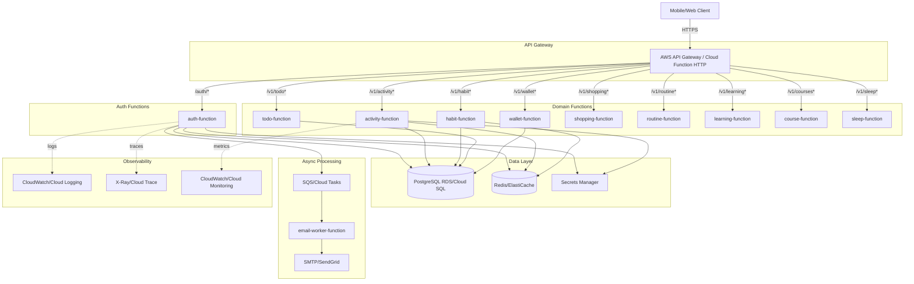
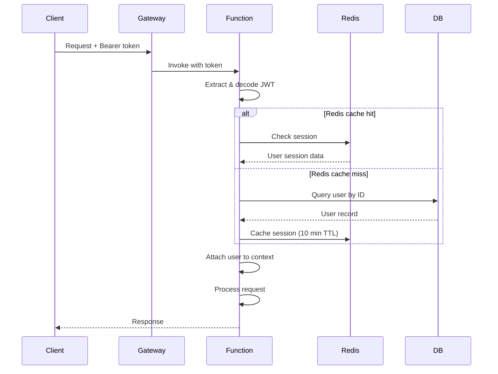
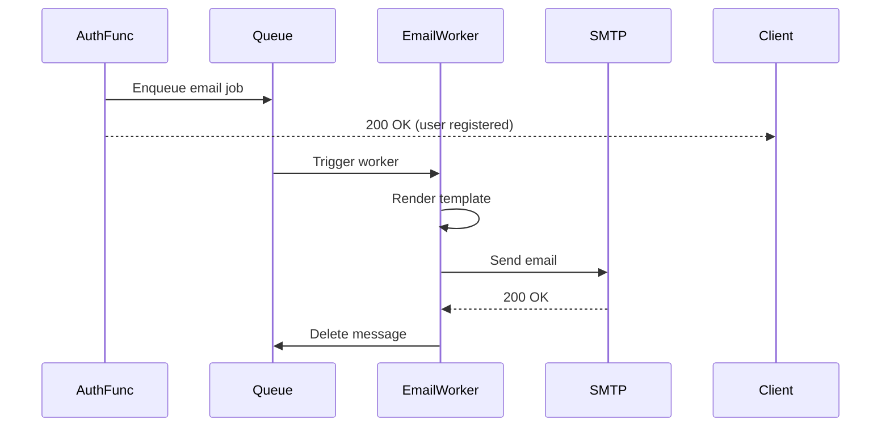

# Target Architecture - Serverless Node.js

## Overview

This document defines the **target serverless architecture** to rebuild the xavier system using Node.js, TypeScript, and cloud functions.

---

## Architecture Principles

1. **Function-per-domain**: Group related endpoints into domain functions (not one function per route)
2. **Shared infrastructure**: Common modules for auth, database, validation
3. **Stateless functions**: No in-memory state, rely on external stores
4. **Managed services**: Use cloud-managed DB, cache, secrets, queues
5. **Cost-optimized**: Bundle efficiently, minimize cold starts, connection pooling
6. **Observable**: Structured logging, distributed tracing, metrics
7. **Secure**: JWT validation, input sanitization, secrets management, HTTPS only

---

## Architecture Diagram



---

## Function Boundaries

### Decision: Domain-Based Functions

**Rationale**:
- **Fewer cold starts**: Related endpoints share warm instances
- **Code reuse**: Shared logic within domain (e.g., wallet balance updates)
- **Better organization**: Domain boundaries clear in codebase
- **Cost-efficient**: Fewer function deployments, shared dependencies

**Alternative (rejected)**: One function per endpoint
- ❌ 150+ functions = management overhead
- ❌ 150+ cold start scenarios
- ❌ More code duplication
- ❌ Higher deployment complexity

---

### Function Mapping

#### 1. Auth Function (`/auth/*`)
**Endpoints**:
- `POST /auth/register`
- `POST /auth/login`
- `GET /auth/verify/:code`
- `POST /auth/resend-verification`
- `POST /auth/verify-token`
- `POST /auth/refresh`

**Responsibilities**:
- User registration & verification
- Login & token generation
- Token validation & refresh
- OTP management
- Redis session management
- Queue email jobs

**Cold Start Optimization**:
- Pre-connect to database (connection pooling)
- Lazy-load email templates
- Bundle size: <5MB

---

#### 2. Activity Function (`/v1/activity*`)
**Endpoints**: 15+ endpoints for categories, activities, follow-ups

**Responsibilities**:
- Activity CRUD
- Category management
- Time tracking (follow-ups)
- Date range queries

**Shared Logic**: Owner validation, date parsing

---

#### 3. Habit Function (`/v1/habit*`, `/v1/follow-ups/habit*`)
**Endpoints**: 15+ endpoints for categories, habits, follow-ups, measures

**Responsibilities**:
- Habit CRUD
- Streak calculation
- Follow-up tracking
- Measure management

**Complex Logic**: Streak updates require atomicity

---

#### 4. Todo Function (`/v1/todo*`)
**Endpoints**: 20+ endpoints for categories, frequencies, lists, todos, subtasks

**Responsibilities**:
- Todo CRUD with subtasks
- List & category management
- Toggle completion
- Bulk operations

**Shared Logic**: Subtask management, frequency handling

---

#### 5. Wallet Function (`/v1/wallet*`)
**Endpoints**: 30+ endpoints for wallets, categories, expenses, budgets, scheduled, periods

**Responsibilities**:
- Wallet CRUD
- Expense tracking
- Budget management
- Scheduled expenses
- Balance calculations

**Critical**: Transaction atomicity for balance updates

---

#### 6. Shopping Function (`/v1/shopping/*`)
**Endpoints**: 12+ endpoints for lists, items, categories

**Responsibilities**:
- Shopping list CRUD
- Item management
- Cost tracking

---

#### 7. Routine Function (`/v1/routine*`)
**Endpoints**: 10+ endpoints for routines, activities, details

**Responsibilities**:
- Routine CRUD
- Activity templates
- Schedule management

---

#### 8. Learning Function (`/v1/learning*`, `/v1/tags*`, `/v1/programming/*`)
**Endpoints**: 15+ endpoints for learning resources, tags, programming topics

**Responsibilities**:
- Learning resource management
- Tag management
- Programming topic tracking

**Shared Logic**: Many-to-many tag relationships

---

#### 9. Course Function (`/v1/courses*`)
**Endpoints**: 8+ endpoints for courses and follow-ups

**Responsibilities**:
- Course tracking
- Progress management
- Follow-up logging

---

#### 10. Sleep Function (`/v1/sleep-tracker*`)
**Endpoints**: 3 endpoints for sleep tracking

**Responsibilities**:
- Sleep entry CRUD
- Date queries

---

#### 11. Email Worker Function (Background)
**Trigger**: Queue messages

**Responsibilities**:
- Send verification emails
- Send notification emails (future)
- Email template rendering

**Not exposed via HTTP**

---

## Database Strategy

### Choice: PostgreSQL (Managed)

**Options Considered**:
1. ✅ **PostgreSQL** (RDS, Cloud SQL, Supabase)
   - Full relational features
   - UUID support
   - JSON columns for flexibility
   - Strong consistency
   - Mature ecosystem
   
2. ❌ DynamoDB
   - NoSQL not ideal for complex relationships
   - Wallet balance atomicity harder
   - Migration effort high
   
3. ❌ MySQL
   - Current system uses it, but PostgreSQL preferred for serverless
   - Better JSON support
   - Better UUID handling

**Why PostgreSQL over MySQL**:
- Native UUID type
- Better JSON/JSONB support (future extensibility)
- Superior connection pooling solutions (PgBouncer)
- Better TypeScript/Node.js ecosystem

---

### Connection Strategy

**Challenge**: Serverless functions create many concurrent connections

**Solution**: Connection Pooling Proxy

#### Option A: PgBouncer (Recommended)
```
Function -> PgBouncer (connection pooler) -> PostgreSQL
```
- Limits connections to PostgreSQL
- Fast connection reuse
- Deploy as sidecar or separate service

#### Option B: Cloud SQL Proxy / RDS Proxy
- Cloud-native solution
- Auto-scaling
- IAM authentication

#### Option C: Supabase
- Built-in connection pooling
- REST API fallback
- Generous free tier

**Implementation**:
```typescript
// Shared database client
import { Pool } from 'pg';

let pool: Pool | null = null;

export function getDbPool(): Pool {
  if (!pool) {
    pool = new Pool({
      host: process.env.DB_HOST,
      port: parseInt(process.env.DB_PORT || '5432'),
      user: process.env.DB_USER,
      password: process.env.DB_PASSWORD,
      database: process.env.DB_NAME,
      max: 2, // Max 2 connections per function instance
      idleTimeoutMillis: 30000,
      connectionTimeoutMillis: 5000,
    });
  }
  return pool;
}
```

**Connection Limits**:
- Each function instance: max 2 connections
- Total functions: 100 concurrent
- PgBouncer pool: 200 connections
- PostgreSQL max connections: 100-500 (cloud dependent)

---

## Authentication Strategy

### JWT Token Validation

**Flow**:


**JWT Structure** (using Sanctum tokens as reference):
```json
{
  "sub": "user_id",
  "email": "user@example.com",
  "iat": 1234567890,
  "exp": 1234567890,
  "jti": "token_id"
}
```

**Validation Steps**:
1. Extract token from `Authorization: Bearer {token}` header
2. Verify JWT signature (using secret from Secrets Manager)
3. Check expiration
4. Check Redis cache for session (key: `session:{token_id}`)
5. If cache miss, query database for user
6. Attach user to request context

**Middleware Implementation**:
```typescript
export async function authMiddleware(req: Request): Promise<User> {
  const token = extractBearerToken(req);
  if (!token) throw new UnauthorizedError('Missing token');
  
  const payload = verifyJWT(token);
  if (isExpired(payload)) throw new UnauthorizedError('Expired token');
  
  // Check Redis cache
  const cached = await redis.get(`session:${payload.jti}`);
  if (cached) return JSON.parse(cached);
  
  // Query database
  const user = await db.query('SELECT * FROM users WHERE id = $1', [payload.sub]);
  if (!user) throw new UnauthorizedError('User not found');
  
  // Cache for 10 minutes
  await redis.setex(`session:${payload.jti}`, 600, JSON.stringify(user));
  
  return user;
}
```

---

## Redis Session Management

**Purpose**: Reduce database queries for authentication

**Data Stored**:
```typescript
{
  user_id: string;
  email: string;
  created_at: string;
}
```

**Keys**:
- `session:{token_id}` → user session data (TTL: 10 minutes)
- `user-sessions:{user_id}` → list of active token IDs (for logout all)

**Operations**:
- **Login**: Create session entry
- **Token refresh**: Update session entry
- **Logout**: Delete session entry
- **Logout all**: Delete all sessions for user

**Redis Client** (Serverless-friendly):
```typescript
import { createClient } from 'redis';

let redis: ReturnType<typeof createClient> | null = null;

export function getRedisClient() {
  if (!redis) {
    redis = createClient({
      url: process.env.REDIS_URL,
      socket: {
        reconnectStrategy: false, // Don't reconnect in serverless
      },
    });
    redis.connect();
  }
  return redis;
}
```

---

## Background Job Processing

### Email Queue

**Service Options**:
1. **AWS SQS** (Simple Queue Service)
2. **Google Cloud Tasks**
3. **Azure Service Bus**

**Flow**:


**Message Format**:
```json
{
  "type": "verification_email",
  "to": "user@example.com",
  "data": {
    "name": "User Name",
    "otp": "123456",
    "user_id": 1,
    "verification_url": "https://app.com/verify?code=base64"
  }
}
```

**Email Worker Function**:
- Triggered by queue
- Renders email template (EJS/Handlebars)
- Sends via SMTP (SendGrid, AWS SES, Mailgun)
- Handles retries (queue-level retry policy)
- Logs success/failure

---

## Secrets Management

**Service**: AWS Secrets Manager, Google Secret Manager, Azure Key Vault

**Secrets**:
- `DB_HOST`, `DB_USER`, `DB_PASSWORD`, `DB_NAME`
- `REDIS_URL`
- `JWT_SECRET`
- `JWT_REFRESH_SECRET`
- `SMTP_HOST`, `SMTP_USER`, `SMTP_PASSWORD`
- `EMAIL_FROM`

**Access Pattern**:
```typescript
import { SecretsManagerClient, GetSecretValueCommand } from '@aws-sdk/client-secrets-manager';

let cachedSecrets: Record<string, string> = {};

export async function getSecret(key: string): Promise<string> {
  if (cachedSecrets[key]) return cachedSecrets[key];
  
  const client = new SecretsManagerClient({ region: 'us-east-1' });
  const command = new GetSecretValueCommand({ SecretId: key });
  const response = await client.send(command);
  
  cachedSecrets[key] = response.SecretString!;
  return cachedSecrets[key];
}
```

**Caching**: Cache secrets in function memory (persist across warm invocations)

---

## File Storage

**Current Need**: None detected (no file uploads in API)

**Future Need**: User avatars, receipt images, document uploads

**Solution**: S3, Cloud Storage, Azure Blob  
**Signed URLs**: For direct upload from client (bypass function)

---

## Caching Strategy

### Response Caching

**Candidates** (read-heavy, user-specific):
- Activity categories list
- Habit categories list
- Todo categories, frequencies, lists
- Wallet categories, frequencies
- Shopping categories
- Learning categories
- Tags

**Strategy**: Redis cache with user-specific keys

**Example**:
```typescript
async function listActivityCategories(userId: string) {
  const cacheKey = `categories:activity:${userId}`;
  const cached = await redis.get(cacheKey);
  if (cached) return JSON.parse(cached);
  
  const categories = await db.query(
    'SELECT * FROM activity_categories WHERE user_id = $1',
    [userId]
  );
  
  await redis.setex(cacheKey, 3600, JSON.stringify(categories)); // 1 hour TTL
  return categories;
}
```

**Cache Invalidation**:
- On create: Invalidate list cache
- On update: Invalidate item + list cache
- On delete: Invalidate item + list cache

---

## Cost Optimization

### Bundle Size Reduction

**Strategy**:
- Use esbuild for bundling (fast, small output)
- External dependencies: Share common modules via Lambda Layers / Cloud Function libraries
- Tree-shaking: Remove unused code
- Minification: Reduce code size

**Target Bundle Sizes**:
- Auth function: < 5MB
- Domain functions: < 3MB each
- Email worker: < 2MB

**Example esbuild config**:
```javascript
require('esbuild').build({
  entryPoints: ['src/functions/auth/index.ts'],
  bundle: true,
  platform: 'node',
  target: 'node18',
  outfile: 'dist/auth.js',
  external: ['aws-sdk', 'pg-native'], // Exclude native modules
  minify: true,
  sourcemap: true,
});
```

---

### Cold Start Mitigation

**Techniques**:
1. **Provisioned Concurrency**: Keep N instances warm (costs $$$)
2. **Warm-up Ping**: Scheduled ping every 5 minutes (cheap)
3. **Lazy Loading**: Import heavy modules only when needed
4. **Connection Reuse**: Cache DB/Redis connections across invocations

**Example**:
```typescript
// ❌ Bad: Load everything upfront
import * as AWS from 'aws-sdk';
import { Pool } from 'pg';
import Redis from 'ioredis';

// ✅ Good: Lazy load
let db: Pool | null = null;
function getDb() {
  if (!db) db = new Pool({...});
  return db;
}

export async function handler(event) {
  const db = getDb(); // Only initialize on first invocation
  // ...
}
```

---

### Concurrency Limits

**Recommended Settings**:
- Auth function: 100 concurrent
- Domain functions: 50 concurrent each
- Email worker: 10 concurrent (SMTP rate limits)

**Database Connection Math**:
```
Max DB connections = SUM(function_concurrency * connections_per_instance)
= (1 auth * 100 * 2) + (9 domains * 50 * 2) + (1 worker * 10 * 2)
= 200 + 900 + 20 = 1120 connections

With PgBouncer: 1120 -> 200 pooled connections -> 100 PostgreSQL connections
```

---

## Multi-Environment Strategy

### Environments

1. **Development** (`dev`)
   - Local testing with Docker Compose
   - Shared dev database
   - Debug logging enabled
   
2. **Staging** (`staging`)
   - Pre-production testing
   - Separate database (copy of production schema)
   - Production-like configuration
   
3. **Production** (`prod`)
   - Live system
   - High availability
   - Monitoring & alerts

### Configuration Management

**Environment Variables** (per environment):
```bash
# dev.env
NODE_ENV=development
DB_HOST=localhost
DB_PORT=5432
REDIS_URL=redis://localhost:6379
LOG_LEVEL=debug

# prod.env
NODE_ENV=production
DB_HOST=prod-db.amazonaws.com
DB_PORT=5432
REDIS_URL=redis://prod-cache.amazonaws.com:6379
LOG_LEVEL=info
```

**Deployment Strategy**:
- Dev: Deploy on push to `develop` branch
- Staging: Deploy on push to `staging` branch
- Production: Deploy on push to `main` branch (with manual approval)

---

## Observability

### Structured Logging

**Format**: JSON logs for easy parsing

**Fields**:
- `timestamp`: ISO 8601
- `level`: debug | info | warn | error
- `message`: Human-readable message
- `correlationId`: Trace request across functions
- `requestId`: Unique per request
- `userId`: Authenticated user ID (if applicable)
- `function`: Function name
- `duration`: Execution time (ms)
- `error`: Error stack trace (if error)

**Example**:
```typescript
import pino from 'pino';

const logger = pino({
  level: process.env.LOG_LEVEL || 'info',
  formatters: {
    level: (label) => ({ level: label }),
  },
});

export function logInfo(message: string, meta: Record<string, any> = {}) {
  logger.info({
    ...meta,
    timestamp: new Date().toISOString(),
    function: process.env.FUNCTION_NAME,
  }, message);
}
```

---

### Distributed Tracing

**Service**: AWS X-Ray, Google Cloud Trace, OpenTelemetry

**Trace Propagation**:
- Client sends `X-Trace-Id` header (or generate if missing)
- Pass `X-Trace-Id` to all downstream calls (DB, Redis, queue)
- Include in logs

**Example**:
```typescript
import { SpanKind, trace } from '@opentelemetry/api';

const tracer = trace.getTracer('xavier-api');

export async function handler(event) {
  const span = tracer.startSpan('auth.login', { kind: SpanKind.SERVER });
  
  try {
    // Business logic
    const result = await login(event);
    span.setStatus({ code: 0 }); // OK
    return result;
  } catch (error) {
    span.setStatus({ code: 2, message: error.message }); // ERROR
    throw error;
  } finally {
    span.end();
  }
}
```

---

### Metrics

**Key Metrics**:
- Request count (by function, endpoint, status code)
- Request duration (p50, p95, p99)
- Error rate (4xx, 5xx)
- Cold start count & duration
- Database query duration
- Redis hit rate
- Queue message age

**Service**: CloudWatch Metrics, Google Cloud Monitoring, Datadog

**Custom Metrics**:
```typescript
import { CloudWatch } from 'aws-sdk';

const cw = new CloudWatch();

export async function trackMetric(name: string, value: number, unit: string) {
  await cw.putMetricData({
    Namespace: 'XavierAPI',
    MetricData: [{
      MetricName: name,
      Value: value,
      Unit: unit,
      Timestamp: new Date(),
    }],
  }).promise();
}

// Usage
await trackMetric('WalletBalanceUpdate', 1, 'Count');
```

---

### Alerts

**Critical Alerts**:
- Error rate > 1% (5 min window) → PagerDuty
- p95 latency > 2s (5 min window) → Slack
- Database connection errors → PagerDuty
- Redis connection errors → Slack
- Email delivery failure rate > 5% → Slack

**Service**: CloudWatch Alarms, Google Cloud Monitoring Alerts, PagerDuty

---

## Deployment Strategy

### Infrastructure as Code

**Recommendation**: Terraform (cloud-agnostic)

**Alternatives**:
- AWS CDK (TypeScript IaC for AWS)
- Serverless Framework (simpler, less control)
- SAM (AWS-specific)

**Terraform Modules**:
- `functions/`: Lambda/Cloud Function definitions
- `database/`: RDS/Cloud SQL setup
- `redis/`: ElastiCache/Memorystore setup
- `queue/`: SQS/Cloud Tasks setup
- `api-gateway/`: API Gateway/Cloud Endpoints setup
- `secrets/`: Secrets Manager setup
- `monitoring/`: CloudWatch/Monitoring setup

**Example**:
```hcl
# functions/auth.tf
resource "aws_lambda_function" "auth" {
  function_name = "xavier-auth-${var.env}"
  runtime       = "nodejs18.x"
  handler       = "index.handler"
  filename      = "dist/auth.zip"
  role          = aws_iam_role.lambda_exec.arn
  
  environment {
    variables = {
      NODE_ENV = var.env
      DB_HOST  = var.db_host
      REDIS_URL = var.redis_url
    }
  }
  
  vpc_config {
    subnet_ids         = var.private_subnet_ids
    security_group_ids = [aws_security_group.lambda.id]
  }
  
  timeout     = 30
  memory_size = 512
}
```

---

### CI/CD Pipeline

**Stages**:
1. **Build**: Compile TypeScript, bundle functions
2. **Test**: Unit tests, integration tests
3. **Lint**: ESLint, Prettier
4. **Package**: Create deployment artifacts (ZIP/Docker)
5. **Deploy Dev**: Auto-deploy to dev on commit to `develop`
6. **Deploy Staging**: Auto-deploy to staging on commit to `staging`
7. **Deploy Prod**: Manual approval, deploy to prod on merge to `main`

**Tool**: GitHub Actions, GitLab CI, CircleCI

**Example** (GitHub Actions):
```yaml
name: Deploy
on:
  push:
    branches: [main, develop, staging]

jobs:
  deploy:
    runs-on: ubuntu-latest
    steps:
      - uses: actions/checkout@v3
      - uses: actions/setup-node@v3
        with:
          node-version: 18
      - run: npm ci
      - run: npm run build
      - run: npm test
      - run: npm run bundle
      - name: Deploy to AWS
        env:
          AWS_ACCESS_KEY_ID: ${{ secrets.AWS_ACCESS_KEY_ID }}
          AWS_SECRET_ACCESS_KEY: ${{ secrets.AWS_SECRET_ACCESS_KEY }}
        run: |
          terraform init
          terraform apply -auto-approve -var="env=${{ github.ref_name }}"
```

---

### Rollback Strategy

**Approaches**:
1. **Blue-Green Deployment**: Deploy new version alongside old, switch traffic
2. **Canary Deployment**: Gradually shift traffic (10% -> 50% -> 100%)
3. **Version Aliasing**: Use Lambda aliases/Cloud Function versions

**Rollback Trigger**:
- Manual rollback command
- Automatic if error rate spikes (circuit breaker)

**Example** (Lambda alias):
```hcl
resource "aws_lambda_alias" "live" {
  name             = "live"
  function_name    = aws_lambda_function.auth.function_name
  function_version = aws_lambda_function.auth.version
  
  routing_config {
    additional_version_weights = {
      (aws_lambda_function.auth_new.version) = 0.1 # 10% traffic to new version
    }
  }
}
```

---

## Summary

### Key Decisions

| Aspect | Decision | Rationale |
|--------|----------|-----------|
| **Functions** | Domain-based (10 functions) | Balance cold starts vs organization |
| **Database** | PostgreSQL (RDS/Cloud SQL) | Relational model, UUID support, connection pooling |
| **Auth** | JWT + Redis cache | Stateless, fast validation |
| **Queue** | SQS/Cloud Tasks | Reliable async processing |
| **IaC** | Terraform | Cloud-agnostic, mature |
| **Language** | TypeScript | Type safety, better DX |
| **Bundler** | esbuild | Fast, small bundles |
| **Logging** | Structured JSON (pino) | Easy parsing, rich context |
| **Tracing** | OpenTelemetry | Vendor-agnostic |

---

### Cost Estimate (AWS, 100K req/month)

- Lambda invocations: $0.20/million = $0.02
- Lambda compute: 512MB * 500ms avg * 100K = 25K GB-seconds = $0.42
- API Gateway: 100K requests = $0.35
- RDS t3.micro: $15/month
- ElastiCache t3.micro: $12/month
- SQS: 100K messages = $0.04
- **Total**: ~$28/month + data transfer

**Scaling**: Linear with requests, but RDS may need upgrade at 1M req/month

---

### Migration Path

1. Set up infrastructure (database, Redis, secrets)
2. Migrate schema (PostgreSQL)
3. Implement shared modules (auth, db, logger, validation)
4. Implement auth function + deploy
5. Implement domain functions one-by-one
6. Parallel run old + new systems
7. Gradual traffic shift (0% -> 10% -> 50% -> 100%)
8. Decommission old Laravel services

---

### Open Questions

1. **Cloud Provider**: AWS, GCP, or Azure?
2. **Database Migrations**: Flyway, Knex, Prisma Migrate?
3. **ORM**: Prisma, TypeORM, Knex, raw SQL?
4. **API Gateway**: AWS API Gateway, GCP Cloud Endpoints, Kong?
5. **Email Service**: SendGrid, AWS SES, Postmark?
6. **Monitoring**: DataDog, New Relic, native cloud?
7. **Error Tracking**: Sentry, Rollbar, Bugsnag?
