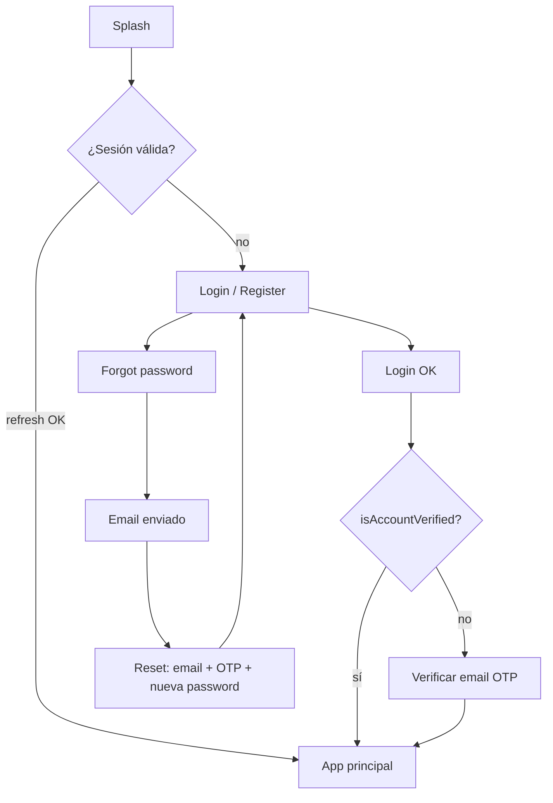

# Especificación frontend — Auth, Hábitos, Actividades y Cursos

Documento orientado a **implementación por IA o equipo frontend** contra el backend `xavi-api` (Node.js + GraphQL + REST auth).

**Versión API:** GraphQL en `/graphql` · REST auth en `/api/auth/*`  
**Última revisión:** 2026-05-19

---

## 1. Resumen ejecutivo

| Área | Protocolo | Autenticación |
|------|-----------|---------------|
| Login, registro, OTP, refresh, logout | **REST** | Público o Bearer según endpoint |
| Hábitos, actividades, cursos | **GraphQL** | `Authorization: Bearer <accessToken>` |

**No usar REST** para CRUD de hábitos/actividades/cursos en código nuevo; esos dominios están en GraphQL. REST legado (`/api/habit`, `/api/activity`, `/api/course`) existe pero debe considerarse deprecado para clientes nuevos.

### URLs base

```text
REST:    {BASE_URL}/api/auth/...
GraphQL: {BASE_URL}/graphql
```

`BASE_URL` ejemplos: `http://localhost:8080` (dev), `https://<cloud-run-host>` (prod).

### Convenciones globales

- **IDs numéricos** en GraphQL se exponen como `ID` (string): `"10"`, `"3"`.
- **IDs UUID** (categorías y medidas de hábito): string UUID v7, p. ej. `"0194a1b2-..."`.
- **Fechas de hábito** (`completedDate`, `date`, `startDate`, `endDate`): string `YYYY-MM-DD`.
- **DateTime** (GraphQL scalar): ISO 8601, p. ej. `2026-05-19T14:30:00.000Z`.
- **Paginación:** `page` (desde 1), `limit` (máx. 100 en validación Zod).

---

## 2. Formato de respuestas REST

Todas las respuestas REST usan envoltorio:

```typescript
// Éxito
interface ApiSuccess<T> {
  status: true;
  data: T;
  message?: string;
  meta?: { env: string };
}

// Error (HTTP 4xx/5xx)
interface ApiError {
  status: false;
  errors: string[];  // mensajes legibles para UI
  env: string;
}
```

**Ejemplo login exitoso:**

```json
{
  "status": true,
  "data": {
    "accessToken": "eyJhbG...",
    "accessExpiresAt": 1716123456789,
    "refreshToken": "eyJhbG...",
    "user": {
      "id": 1,
      "email": "user@example.com",
      "name": "Jane",
      "isAccountVerified": true
    }
  },
  "meta": { "env": "development" }
}
```

---

## 3. Autenticación (REST)

### 3.1 Reglas de contraseña

Aplica a **registro** y **reset-password**:

- Mínimo 8 caracteres
- Al menos 1 mayúscula, 1 minúscula, 1 número

### 3.2 Tokens

| Token | Uso | Duración típica |
|-------|-----|-----------------|
| `accessToken` | Header `Authorization: Bearer ...` en GraphQL y REST protegido | Corta (JWT `exp` → `accessExpiresAt` en ms) |
| `refreshToken` | Solo endpoints `/api/auth/refresh` y `/api/auth/logout` | 7 días; **rotación** en cada refresh |

**Almacenamiento recomendado (cliente):**

- `accessToken` + `accessExpiresAt`: memoria o `sessionStorage`
- `refreshToken`: `httpOnly` cookie si el stack lo permite; si no, `secureStorage` / Keychain con mitigación XSS
- Refrescar access token **antes** de `accessExpiresAt` (p. ej. 60 s de margen)

### 3.3 Flujo de pantallas (auth)



### 3.4 Endpoints REST — referencia

#### `POST /api/auth/register` (público)

**Body:**

```json
{
  "email": "user@example.com",
  "password": "Secret123",
  "name": "Jane Doe"
}
```

**Response `201`:**

```json
{
  "status": true,
  "data": {
    "user": { "id": 1, "email": "...", "name": "...", "isAccountVerified": false, "createdAt": "..." },
    "message": "Registration successful. Please verify your email.",
    "emailSent": true
  }
}
```

**UI:** redirigir a pantalla de verificación OTP (6 dígitos). No hay tokens hasta login.

---

#### `POST /api/auth/login` (público)

**Body:**

```json
{ "email": "user@example.com", "password": "Secret123" }
```

**Response `200`:**

```json
{
  "status": true,
  "data": {
    "accessToken": "...",
    "accessExpiresAt": 1716123456789,
    "refreshToken": "...",
    "user": {
      "id": 1,
      "email": "...",
      "name": "...",
      "isAccountVerified": true
    },
    "nextResendAvailableAt": "2026-05-19T15:05:00.000Z"
  }
}
```

`nextResendAvailableAt` solo si `isAccountVerified === false` (cooldown reenvío OTP: **5 minutos**).

**Errores:** `401` → `Invalid credentials` (mensaje genérico en UI).

---

#### `POST /api/auth/verify-email` (público)

Verificación tras registro (sin estar logueado).

**Body:**

```json
{ "email": "user@example.com", "code": "123456" }
```

`code`: exactamente **6 dígitos**.

**Response:** `{ "message": "Email verified successfully" }` → navegar a Login.

---

#### `POST /api/auth/forgot-password` (público)

**Body:** `{ "email": "user@example.com" }`

**Response siempre genérico (seguridad):**

```json
{
  "status": true,
  "data": {
    "message": "If an account exists with this email, a password reset code has been sent."
  }
}
```

**UI:** mostrar el mismo mensaje aunque el email no exista. Cooldown reenvío: **5 minutos** (el backend no expone timer; opcional: deshabilitar botón 5 min en cliente).

---

#### `POST /api/auth/reset-password` (público)

**Body:**

```json
{
  "email": "user@example.com",
  "code": "123456",
  "password": "NewSecret123"
}
```

**Response:** `{ "message": "Password reset successful" }`  
**Efecto:** revoca todos los `refreshToken` del usuario → forzar login de nuevo.

**Errores:** `400` → `Invalid or expired reset code`.

---

#### `POST /api/auth/refresh` (público)

**Body:** `{ "refreshToken": "<refresh>" }`

**Response:**

```json
{
  "status": true,
  "data": {
    "accessToken": "...",
    "accessExpiresAt": 1716123456789,
    "refreshToken": "<nuevo refresh>",
    "user": { "id": 1, "email": "...", "name": "...", "isAccountVerified": true }
  }
}
```

**Importante:** guardar el **nuevo** `refreshToken` (rotación). El anterior queda revocado.

---

#### `POST /api/auth/logout` (público)

**Body:** `{ "refreshToken": "<refresh>" }`  
Revoca ese refresh token. Borrar tokens locales.

---

#### `GET /api/auth/profile` (Bearer)

**Response:**

```json
{
  "status": true,
  "data": {
    "user": {
      "id": 1,
      "email": "...",
      "name": "...",
      "isAccountVerified": true,
      "createdAt": "..."
    }
  }
}
```

---

#### Verificación cuenta (logueado, opcional)

Si el usuario entró con `isAccountVerified: false`:

| Método | Ruta | Body |
|--------|------|------|
| POST | `/api/auth/resend-otp` | `{}` (usa `req.user`) |
| POST | `/api/auth/verify-account` | `{ "code": "123456" }` |

Tras verificar, actualizar estado local del usuario.

---

### 3.5 Cliente HTTP — interceptor sugerido

```typescript
async function graphqlRequest<T>(query: string, variables?: object): Promise<T> {
  const token = await getValidAccessToken(); // refresh si expira pronto
  const res = await fetch(`${BASE_URL}/graphql`, {
    method: 'POST',
    headers: {
      'Content-Type': 'application/json',
      Authorization: `Bearer ${token}`,
    },
    body: JSON.stringify({ query, variables }),
  });
  const json = await res.json();
  if (json.errors?.length) throw new GraphQLClientError(json.errors);
  return json.data;
}
```

---

## 4. GraphQL — errores y autenticación

### 4.1 Errores

- **No autenticado / token inválido:** mensaje tipo `Authentication required` o `Unauthorized` en `errors[].message`.
- **Validación Zod:** `extensions.code === 'BAD_USER_INPUT'` y `extensions.validationErrors[]` con `path` y `message`.
- Mostrar el primer error de validación o lista según UX.

### 4.2 Introspection

Habilitada solo en `NODE_ENV !== 'production'`. En prod usar este documento o colecciones Bruno en `bruno/xavi-*-graphql/`.

---

## 5. Módulo — Actividades

**Documentación adicional:** `docs/graphql/activity-bruno.md`  
**Migración DB:** `migrations/025_activity_categories_and_followups.sql`

### 5.1 Modelo de dominio

| Concepto | Uso |
|----------|-----|
| **Activity** | Tarea con estado, prioridad, fecha programada; opcionalmente categoría |
| **ActivityCategory** | Agrupación simple (UUID), como `HabitCategory` |
| **ActivityFollowUp** | Registro de tiempo: día, hora inicio, duración en minutos (la hora fin **no se guarda**, se calcula en API) |

- **IDs actividad / follow-up:** numéricos como `ID` string (`"7"`).
- **IDs categoría:** UUID v7.

### 5.2 Enums

```typescript
type ActivityStatus = 'pending' | 'in_progress' | 'completed' | 'cancelled';
type ActivityPriority = 'low' | 'medium' | 'high' | 'urgent';
```

### 5.3 Operaciones

#### Actividades

| Tipo | Operación | Descripción |
|------|-----------|-------------|
| Query | `activity(id)` | Detalle + `category`, `followUps`, `spentTimeMinutes` |
| Query | `activities(...)` | Listado; filtros `status`, `priority`, `categoryId`, fechas, paginación |
| Mutation | `activityAdd` / `activityEdit` / `activityRemove` | CRUD |
| Mutation | `activityComplete(id)` | Marca `completed` + `completedAt` |

#### Categorías

| Tipo | Operación |
|------|-----------|
| Query | `activityCategories`, `activityCategory(id)` |
| Mutation | `activityCategoryAdd`, `activityCategoryEdit`, `activityCategoryRemove` |

No eliminar categoría si hay actividades con `categoryId` asignado.

#### Follow-ups (time tracking)

| Tipo | Operación |
|------|-----------|
| Query | `activityFollowUp(id)`, `activityFollowUps(activityId, from, to)` |
| Query | `activityDayFollowUps(date)`, `activityFollowUpsInDates(from, to)` |
| Mutation | `activityFollowUpAdd`, `activityFollowUpEdit`, `activityFollowUpRemove` |

Campos calculados en cada follow-up: `endTime`, `endDate`, `endDateTime` (= `date` + `startTime` + `durationMinutes`).

### 5.4 Fragmentos TypeScript

```typescript
interface ActivityCategory {
  id: string;
  userId: number;
  orderIndex: number;
  name: string;
  description: string | null;
  icon: string | null;
  color: string | null;
}

interface ActivityFollowUp {
  id: string;
  activityId: string;
  date: string; // YYYY-MM-DD
  startTime: string; // HH:mm:ss
  durationMinutes: number;
  endTime: string;
  endDate: string;
  endDateTime: string;
  notes: string | null;
}

interface Activity {
  id: string;
  userId: number;
  title: string;
  description: string | null;
  status: ActivityStatus;
  priority: ActivityPriority;
  categoryId: string | null;
  scheduledDate: string | null;
  completedAt: string | null;
  spentTimeMinutes: number;
  category?: ActivityCategory | null;
}
```

### 5.5 Queries de ejemplo

```graphql
query Activities($status: ActivityStatus, $categoryId: ID, $page: Int) {
  activities(status: $status, categoryId: $categoryId, page: $page, limit: 20) {
    activities {
      id
      title
      status
      priority
      categoryId
      category { id name color icon }
      spentTimeMinutes
    }
    total
  }
}

query Activity($id: ID!) {
  activity(id: $id) {
    id
    title
    category { id name }
    spentTimeMinutes
    followUps(limit: 20) {
      id
      date
      startTime
      durationMinutes
      endTime
      notes
    }
  }
}

query ActivityDayFollowUps($date: String!) {
  activityDayFollowUps(date: $date) {
    id
    activityId
    startTime
    durationMinutes
    endDateTime
    activity { id title }
  }
}
```

### 5.6 Mutations de ejemplo

```graphql
mutation ActivityAdd($input: ActivityInput!) {
  activityAdd(input: $input) {
    id
    title
    categoryId
  }
}

mutation ActivityFollowUpAdd($input: ActivityFollowUpAddInput!) {
  activityFollowUpAdd(input: $input) {
    id
    date
    startTime
    durationMinutes
    endTime
    endDateTime
  }
}
```

**Variables `activityFollowUpAdd`:**

```json
{
  "input": {
    "activityId": "7",
    "date": "2026-05-20",
    "startTime": "09:30",
    "durationMinutes": 90,
    "notes": "Deep work"
  }
}
```

### 5.7 Pantallas sugeridas (IA)

1. **Lista** — filtros status/priority/categoría, FAB crear, swipe completar.
2. **Detalle** — edición, lista de follow-ups, total `spentTimeMinutes`.
3. **Registrar tiempo** — formulario día + hora inicio + duración → `activityFollowUpAdd`.
4. **Categorías** — settings con CRUD `activityCategory*`.
5. **Vista día** — `activityDayFollowUps(date)` o calendario con `activityFollowUpsInDates`.

---

## 6. Módulo — Hábitos

**Documentación adicional:** `docs/graphql/habit-bruno.md`  
**Migración DB Fase 2:** `migrations/024_habit_legacy_phase2.sql` (categorías UUID, follow-ups, rachas).

### 6.1 Conceptos

| Concepto | Uso |
|----------|-----|
| **Habit** | Definición del hábito (metas, frecuencia, racha persistida) |
| **HabitLog** | Registro histórico por día (Fase 1; suma count/time si mismo día) |
| **HabitFollowUp** | Check-in diario (Fase 2; recomendado para UI tipo “Mi día”) |
| **HabitCategory** | Agrupación visual (UUID) |
| **HabitMeasure** | Unidad de medida (UUID) |
| **Activity** | Opcional: `activityId` en hábito; field `Habit.activity` |

### 6.2 Enums

```typescript
type HabitFrequency = 'daily' | 'weekly' | 'custom';
```

### 6.3 Operaciones principales

#### Queries

| Operación | Parámetros clave |
|-----------|------------------|
| `habits` | `isActive`, `categoryId`, `page`, `limit` |
| `habit(id)` | + fields `followUps`, `stats`, `category`, `measure`, `activity` |
| `habitMyDay(date)` | **Pantalla principal diaria** — `date: "YYYY-MM-DD"` |
| `habitFollowUps` | `habitId`, `from`, `to`, `isArchived`, `limit` |
| `habitFollowUpsInDates(from, to)` | Calendario / heatmap |
| `habitCategories` / `habitCategory(id)` | CRUD categorías |
| `habitMeasures` / `habitMeasure(id)` | CRUD medidas |
| `habitLogs(habitId, ...)` | Histórico logs |
| `habitStats(habitId)` | Estadísticas |

#### Mutations

| Operación | Notas de negocio |
|-----------|------------------|
| `habitAdd` / `habitEdit` / `habitRemove` | |
| `habitLogAdd` | Mismo día → **acumula** count/time |
| `habitFollowUpAdd` | `isAccomplished: true` → actualiza `streak`/`maxStreak` |
| `habitFollowUpEdit` | Puede archivar |
| `habitFollowUpRemove` | |
| `habitCategoryAdd/Edit/Remove` | |
| `habitMeasureAdd/Edit/Remove` | |

### 6.4 Pantalla “Mi día” (crítica)

```graphql
query HabitMyDay($date: String!) {
  habitMyDay(date: $date) {
    habit {
      id
      name
      icon
      color
      isCounter
      isTimer
      dailyGoal
      timerGoal
      timesGoal
      streak
      maxStreak
      category { id name color icon }
    }
    followUp {
      id
      count
      time
      isAccomplished
      isFailed
      notes
    }
  }
}
```

**Comportamiento UI:**

- Lista hábitos activos para la fecha.
- `followUp === null` → no registrado hoy (botón “Marcar”).
- Tap completar → `habitFollowUpAdd` o `habitFollowUpEdit` según exista registro.
- Hábitos timer/contador: enviar `time` / `count` según flags del hábito.

**Ejemplo follow-up timer cumplido:**

```json
{
  "input": {
    "habitId": "10",
    "date": "2026-05-19",
    "time": 35,
    "isAccomplished": true
  }
}
```

### 6.5 Vinculación con actividad

En `habitAdd` / `habitEdit`, campo opcional `activityId: Int` (ID numérico de `Activity`, no string GraphQL).

Resolver `Habit.activity` devuelve `Activity` completo si está vinculado.

### 6.6 Rachas y fallos

- `habitFollowUpAdd` con `isFailed: true` → racha a 0 y lógica de `endDate`/`restartCount` (backend). El historial de días previos permanece visible.
- `stats.streak` / `habit.streak` — preferir campos del hábito en UI de racha actual.
- Consultar `habitStats` para dashboard.

### 6.7 Pantallas sugeridas (IA)

1. **Mi día** — fecha picker + `habitMyDay`.
2. **Lista hábitos** — `habits`, filtros categoría/activos.
3. **Detalle hábito** — stats, follow-ups recientes, editar.
4. **Categorías / medidas** — settings.
5. **Calendario** — `habitFollowUpsInDates`.
6. **Crear hábito** — wizard (tipo contador/timer, metas, categoría).

---

## 7. Módulo — Cursos

**Documentación adicional:** `docs/graphql/course-bruno.md`

### 7.1 Jerarquía

```text
Course
 └── CourseModule (orderIndex)
      └── CourseLesson (orderIndex, contentType, contentUrl)
           └── UserCourseLessonProgress (completed, notes)
```

### 7.2 Enums

```typescript
type CourseDifficulty = 'beginner' | 'intermediate' | 'advanced';
type CourseStatus = 'not_started' | 'in_progress' | 'completed';
type LessonContentType = 'video' | 'text' | 'quiz' | 'exercise' | 'assignment';
```

### 7.3 Campos de progreso en `Course`

| Campo | Descripción |
|-------|-------------|
| `totalModules` | Conteo módulos |
| `totalLessons` | Total lecciones |
| `completedLessons` | Lecciones marcadas completas |
| `progress` | Porcentaje 0–100 (entero redondeado) |
| `modules` | Árbol anidado con `lessons[].completed` |

### 7.4 Operaciones

#### Queries

| Operación | Uso |
|-----------|-----|
| `courses(status, difficulty, page, limit)` | Biblioteca / mis cursos |
| `course(id)` | Detalle con `modules { lessons { completed } }` |
| `courseProgress(courseId)` | Resumen stats + `startedDate` / `lastActivity` |

#### Mutations

| Operación | REST equivalente |
|-----------|------------------|
| `courseAdd` / `courseEdit` / `courseRemove` | CRUD curso |
| `courseModuleAdd/Edit/Remove` | Módulos |
| `courseLessonAdd/Edit/Remove` | Lecciones |
| `courseLessonProgress` | Marcar lección completa/incompleta |

### 7.5 Marcar progreso de lección

```graphql
mutation CourseLessonProgress($input: CourseLessonProgressInput!) {
  courseLessonProgress(input: $input) {
    progress {
      lessonId
      completed
      completionDate
      notes
    }
    courseStatus
  }
}
```

```json
{
  "input": {
    "courseId": "3",
    "lessonId": "20",
    "completed": true,
    "notes": "Visto el vídeo"
  }
}
```

**Efecto automático:** recalcula `Course.status` (`not_started` → `in_progress` → `completed`).

### 7.6 Query detalle curso

```graphql
query Course($id: ID!) {
  course(id: $id) {
    id
    title
    description
    instructor
    difficulty
    status
    progress
    totalLessons
    completedLessons
    modules {
      id
      title
      orderIndex
      lessons {
        id
        title
        contentType
        contentUrl
        durationMinutes
        orderIndex
        completed
        completionDate
      }
    }
  }
}
```

### 7.7 Crear estructura (orden recomendado)

1. `courseAdd` → obtener `courseId`
2. `courseModuleAdd` con `orderIndex` 0, 1, 2…
3. `courseLessonAdd` por cada módulo con `orderIndex`
4. Usuario consume lecciones → `courseLessonProgress`

**Inputs obligatorios:**

- Módulo: `courseId`, `title`, `orderIndex`
- Lección: `courseId`, `moduleId`, `title`, `orderIndex`

### 7.8 Pantallas sugeridas (IA)

1. **Lista cursos** — tarjetas con barra `progress`.
2. **Detalle curso** — acordeón módulos → lecciones, checkbox completar.
3. **Reproductor / lector** — abrir `contentUrl` según `contentType`.
4. **Editor curso** (opcional) — flujo crear módulo/lección.
5. **Dashboard progreso** — `courseProgress`.

---

## 8. Navegación de app (propuesta)

```text
/auth
  /login
  /register
  /verify-email
  /forgot-password
  /reset-password

/app (requiere sesión)
  /today          → HabitMyDay + actividades del día (opcional)
  /habits         → lista + detalle + categorías
  /activities     → lista + detalle
  /courses        → lista + detalle lección
  /profile        → GET /api/auth/profile, logout
```

**Guard de ruta:** si no hay `accessToken` válido → `/login`. Si `!isAccountVerified` → `/verify-email` o banner + `verify-account`.

---

## 9. Estado global recomendado

```typescript
interface AuthState {
  accessToken: string | null;
  accessExpiresAt: number | null;
  refreshToken: string | null;
  user: {
    id: number;
    email: string;
    name: string;
    isAccountVerified: boolean;
  } | null;
}

// React Query / TanStack Query keys sugeridas
['habits', { isActive, categoryId, page }]
['habit', id]
['habitMyDay', date]
['activities', filters]
['activity', id]
['courses', filters]
['course', id]
['courseProgress', courseId]
```

Invalidar tras mutations:

- `habitFollowUpAdd` → `habitMyDay`, `habit`, `habits`
- `courseLessonProgress` → `course`, `courses`, `courseProgress`

---

## 10. Checklist de implementación (IA)

### Fase A — Infra

- [ ] Variables entorno `VITE_API_URL` / `NEXT_PUBLIC_API_URL`
- [ ] Cliente REST con tipos `ApiSuccess` / `ApiError`
- [ ] Cliente GraphQL con Bearer + manejo `errors`
- [ ] Refresh token automático + cola de peticiones
- [ ] Persistencia sesión y logout

### Fase B — Auth UI

- [ ] Login, register, verify-email (6 dígitos)
- [ ] Forgot + reset password
- [ ] Profile + logout
- [ ] Guard rutas y estado `isAccountVerified`

### Fase C — Actividades

- [ ] Lista paginada + filtros
- [ ] CRUD actividades + `activityComplete`
- [ ] CRUD categorías (`activityCategory*`)
- [ ] Follow-ups de tiempo (`activityFollowUp*`, `activityDayFollowUps`)

### Fase D — Hábitos

- [ ] `habitMyDay` como home
- [ ] CRUD hábitos, categorías, medidas
- [ ] Follow-ups (add/edit/remove)
- [ ] Opcional: calendario `habitFollowUpsInDates`

### Fase E — Cursos

- [ ] Lista con progreso
- [ ] Detalle módulos/lecciones
- [ ] `courseLessonProgress`
- [ ] Opcional: editor de curso

### Fase E — QA

- [ ] Token expirado → refresh silencioso
- [ ] Reset password → sesiones cerradas
- [ ] Errores validación GraphQL en formularios
- [ ] Offline / retry (opcional)

---

## 11. Referencias en el repositorio

| Recurso | Ruta |
|---------|------|
| Auth routes | `src/routes/auth.ts` |
| Auth validators | `src/validators/auth.validator.ts` |
| GraphQL hábitos | `src/graphql/modules/habit/` |
| GraphQL actividades | `src/graphql/modules/activity/` |
| GraphQL cursos | `src/graphql/modules/course/` |
| Bruno hábitos | `bruno/xavi-habit-graphql/` |
| Bruno actividades | `bruno/xavi-activity-graphql/` |
| Bruno cursos | `bruno/xavi-course-graphql/` |
| Contexto agentes | `AGENTS.md` |

---

## 12. Fuera de alcance (este documento)

- Wallet, gastos, shopping, sleep, learning, todos, routines (tienen GraphQL propio; ver `docs/graphql/`).
- Wallet REST legado `/api/wallet/account`.
- Eliminación de cuenta (`/api/auth/request-account-deletion`, etc.).
- i18n, theming, notificaciones push.

---

## 13. Prompt corto para pegar en una IA

```text
Implementa un frontend [React Native / Next.js / Flutter — elegir stack] para xavi-api.

Lee y sigue estrictamente: docs/frontend/FRONTEND_SPEC_HABITS_ACTIVITIES_COURSES.md

Requisitos:
- Auth REST en /api/auth (login, register, verify-email, forgot/reset password, refresh, logout, profile)
- Datos de hábitos, actividades y cursos solo por GraphQL POST /graphql con Bearer token
- Pantalla principal de hábitos: habitMyDay(date)
- Cursos: vista jerárquica módulos/lecciones y mutation courseLessonProgress
- Manejo de errores ApiSuccess/ApiError y GraphQL BAD_USER_INPUT
- Refresh token con rotación antes de expirar access token

Entrega: estructura de carpetas, tipos TypeScript, hooks/servicios API, pantallas mínimas funcionales, sin mocks.
```
