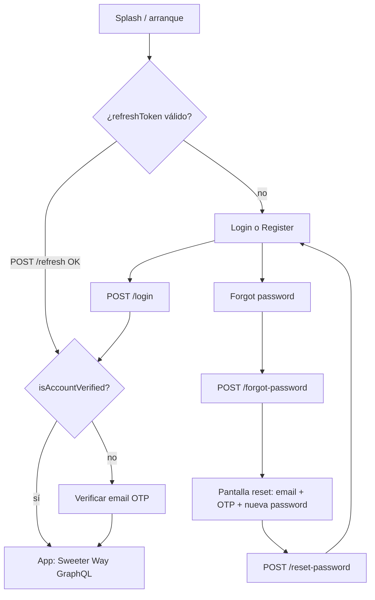
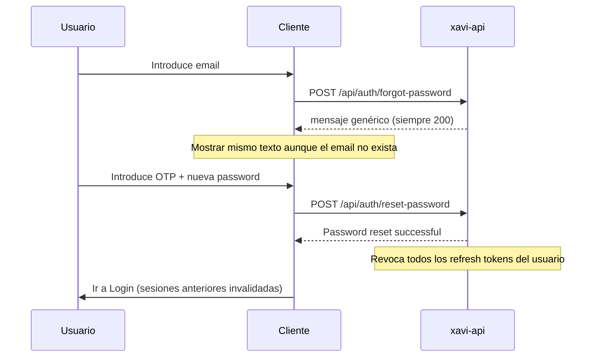
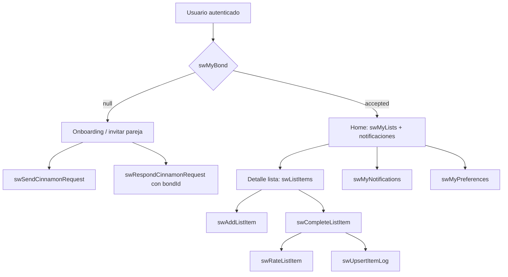
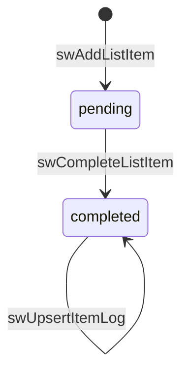

# Especificación frontend — Auth + Sweeter Way

Documento autocontenido para **implementación por IA o equipo frontend** contra el backend `xavi-api` (Node.js + TypeScript).

**Versión API:** REST auth en `/api/auth/*` · GraphQL Sweeter Way en `/graphql`  
**Última revisión:** 2026-05-28

---

## 1. Resumen ejecutivo

| Área | Protocolo | Autenticación |
|------|-----------|---------------|
| Registro, login, OTP, refresh, logout, recuperar contraseña | **REST** | Público o `Bearer` según endpoint |
| Sweeter Way (pareja, listas, ítems, logs, notificaciones) | **GraphQL** | `Authorization: Bearer <accessToken>` |

### URLs base

| Entorno | `BASE_URL` | Auth (REST) | GraphQL |
|---------|------------|-------------|---------|
| **Desarrollo** | `http://localhost:8080` | `http://localhost:8080/api/auth/...` | `http://localhost:8080/graphql` |
| **Producción (Cloud Run)** | `https://xavi-api-2772744525.us-central1.run.app` | `https://xavi-api-2772744525.us-central1.run.app/api/auth/...` | `https://xavi-api-2772744525.us-central1.run.app/graphql` |

**Producción — endpoints completos más usados:**

```text
Login:           POST https://xavi-api-2772744525.us-central1.run.app/api/auth/login
Registro:        POST https://xavi-api-2772744525.us-central1.run.app/api/auth/register
Forgot password: POST https://xavi-api-2772744525.us-central1.run.app/api/auth/forgot-password
Reset password:  POST https://xavi-api-2772744525.us-central1.run.app/api/auth/reset-password
Refresh token:   POST https://xavi-api-2772744525.us-central1.run.app/api/auth/refresh
Perfil:          GET  https://xavi-api-2772744525.us-central1.run.app/api/auth/profile

Sweeter Way:     POST https://xavi-api-2772744525.us-central1.run.app/graphql
Health check:    GET  https://xavi-api-2772744525.us-central1.run.app/api/health
```

En código cliente, define una constante por entorno:

```typescript
const API_BASE_URL =
  process.env.NODE_ENV === 'production'
    ? 'https://xavi-api-2772744525.us-central1.run.app'
    : 'http://localhost:8080';

const AUTH_BASE = `${API_BASE_URL}/api/auth`;
const GRAPHQL_URL = `${API_BASE_URL}/graphql`;
```

La misma URL de Cloud Run sirve para **auth** y **GraphQL** (un solo servicio `xavi-api`).

### Convenciones globales

- **IDs de usuario** en GraphQL: tipo `ID`, valor string numérico (`"42"`).
- **IDs de entidades Sweeter Way** (bond, lista, ítem, notificación): UUID v7 como string.
- **DateTime** (GraphQL): ISO 8601, p. ej. `2026-05-28T14:30:00.000Z`.
- **Fechas solo día** (otros módulos): `YYYY-MM-DD` — no aplica a Sweeter Way.

---

## 2. Formato de respuestas REST

Todas las respuestas REST usan envoltorio:

```typescript
interface ApiSuccess<T> {
  status: true;
  data: T;
  message?: string;
  meta?: { env: string };
}

interface ApiError {
  status: false;
  errors: string[]; // mensajes legibles para UI
  env: string;
}
```

**Ejemplo de error HTTP 400:**

```json
{
  "status": false,
  "errors": ["Invalid verification code"],
  "env": "development"
}
```

**Cliente REST sugerido:**

```typescript
async function apiPost<T>(path: string, body: object, token?: string): Promise<T> {
  const headers: Record<string, string> = { 'Content-Type': 'application/json' };
  if (token) headers.Authorization = `Bearer ${token}`;

  const res = await fetch(`${BASE_URL}${path}`, {
    method: 'POST',
    headers,
    body: JSON.stringify(body),
  });

  const json = await res.json();
  if (!json.status) {
    throw new ApiClientError(json.errors ?? ['Request failed'], res.status);
  }
  return json.data as T;
}
```

---

## 3. Autenticación (REST)

### 3.1 Reglas de contraseña

Aplica a **registro** (`POST /api/auth/register`) y **reset-password** (`POST /api/auth/reset-password`):

- Mínimo **8** caracteres
- Al menos **1** mayúscula, **1** minúscula, **1** número

### 3.2 Tokens

| Token | Uso | Duración |
|-------|-----|----------|
| `accessToken` | Header `Authorization: Bearer ...` en GraphQL y REST protegido | JWT corto; expiración en `accessExpiresAt` (ms epoch) |
| `refreshToken` | Solo `/api/auth/refresh` y `/api/auth/logout` | **7 días**; **rotación** en cada refresh |

**Almacenamiento recomendado (cliente):**

- `accessToken` + `accessExpiresAt`: memoria o `sessionStorage`
- `refreshToken`: almacenamiento seguro (Keychain / Keystore / httpOnly cookie si el stack lo permite)
- Refrescar el access token **antes** de `accessExpiresAt` (margen sugerido: 60 s)

### 3.3 Códigos OTP

- Longitud: **6 dígitos** (`"123456"`)
- Expiración por defecto: **15 minutos** (`EMAIL_OTP_EXPIRATION_MINUTES`, `PASSWORD_RESET_OTP_EXPIRATION_MINUTES`; fallback 15)
- Cooldown de reenvío (forgot-password, resend OTP verificación): **5 minutos** entre envíos al mismo usuario

### 3.4 Flujo general de la app



### 3.5 Flujo recuperar contraseña (detalle)



**Pantallas sugeridas:**

1. **Forgot password:** campo email → `POST /api/auth/forgot-password` → mensaje de éxito genérico.
2. **Reset password:** email (pre-rellenado), código 6 dígitos, nueva contraseña + confirmación en cliente → `POST /api/auth/reset-password`.
3. Tras éxito → **Login** (no reutilizar tokens viejos).

**Reenvío de código reset:** volver a llamar `forgot-password` con el mismo email; respetar cooldown de 5 min en UI (el backend no devuelve countdown en este endpoint).

---

## 4. Endpoints REST — referencia completa

Prefijo: `/api/auth`

### 4.1 `POST /api/auth/register` (público)

Crea cuenta. **No devuelve tokens**; el usuario debe verificar email y luego hacer login.

**Body:**

```json
{
  "email": "user@example.com",
  "password": "Secret123",
  "name": "Jane Doe"
}
```

**Response `201`:**

```json
{
  "status": true,
  "data": {
    "user": {
      "id": 1,
      "email": "user@example.com",
      "name": "Jane Doe",
      "isAccountVerified": false,
      "createdAt": "2026-05-28T10:00:00.000Z"
    },
    "message": "Registration successful. Please verify your email.",
    "emailSent": true
  }
}
```

**Errores:** `409` → `User already exists with this email`

**UI:** pantalla OTP con el email usado en registro → `verify-email` → Login.

---

### 4.2 `POST /api/auth/login` (público)

**Body:**

```json
{ "email": "user@example.com", "password": "Secret123" }
```

**Response `200`:**

```json
{
  "status": true,
  "data": {
    "accessToken": "eyJhbG...",
    "accessExpiresAt": 1716123456789,
    "refreshToken": "eyJhbG...",
    "user": {
      "id": 1,
      "email": "user@example.com",
      "name": "Jane Doe",
      "isAccountVerified": true
    },
    "nextResendAvailableAt": "2026-05-28T15:05:00.000Z"
  }
}
```

- `nextResendAvailableAt`: solo si `isAccountVerified === false` (ISO 8601; cooldown reenvío OTP **5 min**).
- **Errores:** `401` → `Invalid credentials` (mensaje genérico en UI; no distinguir email vs password).

**UI tras login:**

- Si `isAccountVerified === false` → pantalla verificación (§4.8) aunque ya haya tokens.
- Si `true` → app principal (Sweeter Way).

---

### 4.3 `POST /api/auth/verify-email` (público)

Verificación tras **registro**, sin Bearer.

**Body:**

```json
{ "email": "user@example.com", "code": "123456" }
```

**Response `200`:**

```json
{
  "status": true,
  "data": { "message": "Email verified successfully" }
}
```

**Errores:**

| HTTP | Mensaje |
|------|---------|
| 404 | `User not found or already verified` |
| 400 | `Invalid verification code` |
| 400 | `Verification code has expired` |

**UI:** navegar a Login.

---

### 4.4 `POST /api/auth/forgot-password` (público)

Solicita código de reset por email.

**Body:**

```json
{ "email": "user@example.com" }
```

**Response `200` (siempre el mismo texto, por seguridad):**

```json
{
  "status": true,
  "data": {
    "message": "If an account exists with this email, a password reset code has been sent."
  }
}
```

- Si el email no existe → misma respuesta.
- Si hay cooldown activo (< 5 min desde último envío) → misma respuesta (no reenvía).

---

### 4.5 `POST /api/auth/reset-password` (público)

**Body:**

```json
{
  "email": "user@example.com",
  "code": "123456",
  "password": "NewSecret123"
}
```

**Response `200`:**

```json
{
  "status": true,
  "data": { "message": "Password reset successful" }
}
```

**Efecto servidor:** revoca **todos** los `refreshToken` del usuario → cerrar sesión en todos los dispositivos.

**Errores:** `400` → `Invalid or expired reset code` (código incorrecto, expirado o sin solicitud previa).

---

### 4.6 `POST /api/auth/refresh` (público)

Renueva access token usando refresh token.

**Body:**

```json
{ "refreshToken": "<refresh actual>" }
```

**Response `200`:**

```json
{
  "status": true,
  "data": {
    "accessToken": "...",
    "accessExpiresAt": 1716123456789,
    "refreshToken": "<NUEVO refresh — guardar obligatorio>",
    "user": {
      "id": 1,
      "email": "...",
      "name": "...",
      "isAccountVerified": true
    }
  }
}
```

**Importante:** persistir el **nuevo** `refreshToken`; el anterior queda revocado.

**Errores:** `401` → `Invalid or expired refresh token` | `Refresh token has been revoked`

**Uso en arranque de app:**

```typescript
async function getValidAccessToken(): Promise<string> {
  const { accessToken, accessExpiresAt, refreshToken } = loadSession();
  if (accessToken && Date.now() < accessExpiresAt - 60_000) return accessToken;
  const data = await apiPost<RefreshData>('/api/auth/refresh', { refreshToken });
  saveSession(data);
  return data.accessToken;
}
```

---

### 4.7 `POST /api/auth/logout` (público)

**Body:**

```json
{ "refreshToken": "<refresh>" }
```

Revoca ese refresh token. Borrar tokens locales en el cliente.

**Response `200`:** `{ "message": "Logged out successfully" }` (o equivalente en `data`).

---

### 4.8 `GET /api/auth/profile` (Bearer)

**Headers:** `Authorization: Bearer <accessToken>`

**Response `200`:**

```json
{
  "status": true,
  "data": {
    "user": {
      "id": 1,
      "email": "user@example.com",
      "name": "Jane Doe",
      "isAccountVerified": true,
      "createdAt": "2026-05-28T10:00:00.000Z"
    }
  }
}
```

**Errores REST protegido:** `401` → `Authentication required`

Útil para obtener `user.id` del usuario logueado (p. ej. comparar con `requesterId` / `addresseeId` en bonds).

---

### 4.9 Verificación de cuenta estando logueado

Si el usuario hizo login con `isAccountVerified === false`:

| Método | Ruta | Auth | Body |
|--------|------|------|------|
| POST | `/api/auth/resend-otp` | Bearer | `{}` |
| POST | `/api/auth/verify-account` | Bearer | `{ "code": "123456" }` |

Tras `verify-account` exitoso, actualizar estado local (`isAccountVerified: true`).

---

## 5. GraphQL — cliente y errores

### 5.1 Request autenticado

```typescript
async function graphqlRequest<T>(
  query: string,
  variables?: Record<string, unknown>
): Promise<T> {
  const token = await getValidAccessToken();
  const res = await fetch(`${BASE_URL}/graphql`, {
    method: 'POST',
    headers: {
      'Content-Type': 'application/json',
      Authorization: `Bearer ${token}`,
    },
    body: JSON.stringify({ query, variables }),
  });
  const json = await res.json();
  if (json.errors?.length) throw new GraphQLClientError(json.errors);
  return json.data as T;
}
```

### 5.2 Errores GraphQL

| Situación | `errors[].message` | `extensions.code` |
|-----------|-------------------|-------------------|
| Sin token / token inválido | `Not authenticated` | `UNAUTHENTICATED` |
| Validación Zod de argumentos | `Validation failed` | `BAD_USER_INPUT` + `validationErrors[]` |
| Negocio (404, 403, 409…) | Mensaje del servidor | `NotFoundError`, etc. + `statusCode` |

Mostrar en formularios el primer `validationErrors[].message` o el `errors[0].message`.

### 5.3 Introspection

Habilitada solo si `NODE_ENV !== 'production'`. En producción usar este documento.

---

## 6. Módulo Sweeter Way — modelo de dominio

Sweeter Way conecta **dos usuarios** en un “cinnamon bond” y permite listas compartidas de experiencias (restaurantes, viajes, etc.), ítems, valoraciones, logs y notificaciones.

| Concepto | Descripción |
|----------|-------------|
| **CinnamonBond** | Vínculo `requester` → `addressee`. Estados: `pending`, `accepted`, `rejected`, `dissolved`. |
| **SweeterList** | Lista compartida dentro de un bond **accepted**. |
| **SWListItem** | Elemento: `pending` → `completed` → rating opcional + log. |
| **SWItemLog** | Un registro por usuario por ítem (`comment`, `liked`). |
| **SWNotification** | Notificación in-app al compañero. |
| **SWUserPreferences** | Preferencias email / in-app / push del módulo. |

### Regla central

Listas, ítems y logs requieren bond con `status === 'accepted'`. Sin bond activo, `swMyLists` y mutaciones de contenido fallan con:

`You need an active cinnamon bond to perform this action`

### Enums TypeScript

```typescript
type BondStatus = 'pending' | 'accepted' | 'rejected' | 'dissolved';

type ListCategory =
  | 'restaurant'
  | 'travel'
  | 'outdoor'
  | 'entertainment'
  | 'culture'
  | 'other';

type ItemStatus = 'pending' | 'completed';

type NotificationType =
  | 'bond_requested'
  | 'bond_accepted'
  | 'bond_rejected'
  | 'item_added'
  | 'item_completed'
  | 'log_added';

type EntityType = 'bond' | 'list' | 'item' | 'log';
```

---

## 7. Sweeter Way — tipos GraphQL

### `SWBondPartner`

Usuario “del otro lado” del vínculo, resuelto según el JWT del viewer.

```graphql
type SWBondPartner {
  id: ID!
  name: String!
  email: String!
}
```

### `CinnamonBond`

```graphql
type CinnamonBond {
  id: ID!
  requesterId: ID!
  addresseeId: ID!
  status: String!
  requestedAt: DateTime!
  respondedAt: DateTime
  createdAt: DateTime!
  updatedAt: DateTime!
  partner: SWBondPartner
}
```

`partner` es el **otro** usuario (no el logueado). Funciona en `swMyBond`, `swMyPendingBondRequests` y en mutaciones que devuelven `CinnamonBond` si pides el campo en la query.

### `SweeterList`

```graphql
type SweeterList {
  id: ID!
  bondId: ID!
  title: String!
  description: String
  category: String!
  createdBy: ID!
  createdAt: DateTime!
  updatedAt: DateTime!
}
```

### `SWListItem`

```graphql
type SWListItem {
  id: ID!
  listId: ID!
  title: String!
  description: String
  address: String
  url: String
  status: String!
  completedAt: DateTime
  addedBy: ID!
  rating: Int
  wouldReturn: Boolean
  createdAt: DateTime!
  updatedAt: DateTime!
}
```

### `SWItemLog`

```graphql
type SWItemLog {
  id: ID!
  itemId: ID!
  userId: ID!
  comment: String
  liked: Boolean
  createdAt: DateTime!
  updatedAt: DateTime!
}
```

### `SWNotification`

```graphql
type SWNotification {
  id: ID!
  recipientId: ID!
  actorId: ID!
  type: String!
  entityType: String!
  entityId: ID!
  readAt: DateTime
  payload: String
  createdAt: DateTime!
  updatedAt: DateTime!
}
```

`payload` es **JSON serializado como string** en la respuesta GraphQL.

### `SWUserPreferences`

```graphql
type SWUserPreferences {
  id: ID!
  userId: ID!
  emailNotifications: Boolean!
  inAppNotifications: Boolean!
  pushToken: String
  pushNotificationsEnabled: Boolean!
  createdAt: DateTime!
  updatedAt: DateTime!
}
```

---

## 8. Sweeter Way — Queries

Todas requieren `Authorization: Bearer <accessToken>`.

### 8.1 `swMyBond`

Bond **accepted** del usuario actual, o `null`.

**No devuelve** solicitudes `pending`, `rejected` ni `dissolved`.

```graphql
query SwMyBond {
  swMyBond {
    id
    requesterId
    addresseeId
    status
    requestedAt
    respondedAt
    partner {
      id
      name
      email
    }
  }
}
```

No hace falta calcular el partner en cliente si pides `partner { id name email }`.

---

### 8.2 `swMyPendingBondRequests`

Solicitudes en estado **`pending`** donde el usuario actual es `requester` (envió la invitación) o `addressee` (debe aceptar/rechazar). Orden: `requestedAt` DESC.

Usar al abrir la app para **no depender de localStorage** ni solo de notificaciones.

```graphql
query SwMyPendingBondRequests {
  swMyPendingBondRequests {
    id
    requesterId
    addresseeId
    status
    requestedAt
    partner {
      id
      name
      email
    }
  }
}
```

**Derivar dirección en el cliente:**

```typescript
type PendingBondView =
  | { direction: 'outgoing'; bond: CinnamonBond } // yo invité, esperando respuesta
  | { direction: 'incoming'; bond: CinnamonBond }; // me invitaron, mostrar aceptar/rechazar

function classifyPendingBond(bond: CinnamonBond, myUserId: number): PendingBondView {
  return Number(bond.requesterId) === myUserId
    ? { direction: 'outgoing', bond }
    : { direction: 'incoming', bond };
}
```

- Tras `swSendCinnamonRequest` exitoso, la solicitud enviada aparecerá aquí (`direction: outgoing`).
- Tras `swRespondCinnamonRequest`, el bond deja de estar `pending` y **desaparece** de esta lista.
- Si rechazan tu invitación: desaparece de pending; el requester recibe notificación `bond_rejected` (y puede refetch esta query).

---

### 8.3 `swMyLists`

Requiere bond `accepted`. Orden: `createdAt` DESC.

```graphql
query SwMyLists {
  swMyLists {
    id
    bondId
    title
    description
    category
    createdBy
    createdAt
    updatedAt
  }
}
```

---

### 8.4 `swListItems`

```graphql
query SwListItems($listId: ID!) {
  swListItems(listId: $listId) {
    id
    listId
    title
    description
    address
    url
    status
    completedAt
    addedBy
    rating
    wouldReturn
    createdAt
    updatedAt
  }
}
```

Variables: `{ "listId": "0194a1b2-c3d4-..." }`  
Orden: `createdAt` ASC.

---

### 8.5 `swItemLogs`

```graphql
query SwItemLogs($itemId: ID!) {
  swItemLogs(itemId: $itemId) {
    id
    itemId
    userId
    comment
    liked
    createdAt
    updatedAt
  }
}
```

Máximo un log por `(itemId, userId)`.

---

### 8.6 `swMyNotifications`

```graphql
query SwMyNotifications($unreadOnly: Boolean) {
  swMyNotifications(unreadOnly: $unreadOnly) {
    id
    actorId
    type
    entityType
    entityId
    readAt
    payload
    createdAt
  }
}
```

- Sin argumento → todas, más recientes primero.
- `unreadOnly: true` → solo `readAt == null`.

**Parsear `payload`:**

```typescript
function parseNotificationPayload(payload: string | null): Record<string, string> {
  if (!payload) return {};
  try {
    return JSON.parse(payload);
  } catch {
    return {};
  }
}
```

| `type` | `entityType` | `entityId` | Campos típicos en payload |
|--------|--------------|------------|---------------------------|
| `bond_requested` | `bond` | bond UUID | — |
| `bond_accepted` | `bond` | bond UUID | — |
| `bond_rejected` | `bond` | bond UUID | — |
| `item_added` | `item` | item UUID | `itemTitle`, `listTitle` |
| `item_completed` | `item` | item UUID | `itemTitle`, `listTitle` |
| `log_added` | `log` | **itemId** (no log id) | `itemTitle` |

---

### 8.7 `swMyPreferences`

Crea preferencias por defecto si no existen (`email` e `inApp` true, push false).

```graphql
query SwMyPreferences {
  swMyPreferences {
    id
    emailNotifications
    inAppNotifications
    pushToken
    pushNotificationsEnabled
  }
}
```

---

## 9. Sweeter Way — Mutations

### 9.1 Bond / pareja

#### `swSendCinnamonRequest`

Invita a otro usuario por **correo electrónico** (debe estar registrado en la plataforma).

```graphql
mutation SwSendCinnamonRequest($addresseeEmail: String!) {
  swSendCinnamonRequest(addresseeEmail: $addresseeEmail) {
    id
    requesterId
    addresseeId
    status
    requestedAt
  }
}
```

Variables:

```json
{ "addresseeEmail": "pareja@example.com" }
```

- El email se normaliza en servidor (`trim` + minúsculas).
- La búsqueda del destinatario es **insensible a mayúsculas**.

| Error | Condición |
|-------|-----------|
| `Invalid email format` | Validación Zod (email mal formado) |
| `No user found with this email` | No existe cuenta con ese correo |
| `Cannot send a bond request to yourself` | Mismo email que el usuario logueado |
| `You already have an active cinnamon bond` | Requester ya tiene bond `accepted` |
| `A pending bond request already exists between these users` | Ya hay `pending` entre ambos |

Efectos: notificación in-app `bond_requested` y email al destinatario si sus preferencias lo permiten.

---

#### `swRespondCinnamonRequest`

Solo el **addressee** puede responder un bond `pending`.

```graphql
mutation SwRespondCinnamonRequest($bondId: ID!, $accept: Boolean!) {
  swRespondCinnamonRequest(bondId: $bondId, accept: $accept) {
    id
    status
    respondedAt
  }
}
```

| `accept` | Resultado |
|----------|-----------|
| `true` | `status: accepted` (+ notificación/email `bond_accepted` al requester) |
| `false` | `status: rejected` (+ notificación/email `bond_rejected` al requester) |

---

#### `swDissolveBond`

```graphql
mutation SwDissolveBond($bondId: ID!) {
  swDissolveBond(bondId: $bondId)
}
```

Solo bond `accepted`. Retorna `true`. Estado → `dissolved`.

---

### 9.2 Listas

```graphql
input SWCreateListInput {
  title: String!
  description: String
  category: String!
}

input SWUpdateListInput {
  title: String
  description: String
  category: String
}
```

| Mutation | Descripción |
|----------|-------------|
| `swCreateList(input: SWCreateListInput!)` | Crea lista en bond activo |
| `swUpdateList(id: ID!, input: SWUpdateListInput!)` | Actualización parcial; al menos un campo |
| `swDeleteList(id: ID!)` | `Boolean`; falla si hay ítems `completed` |

Ejemplo crear:

```graphql
mutation SwCreateList($input: SWCreateListInput!) {
  swCreateList(input: $input) {
    id
    title
    category
  }
}
```

```json
{
  "input": {
    "title": "Restaurantes Madrid",
    "description": "Fines de semana",
    "category": "restaurant"
  }
}
```

---

### 9.3 Ítems

```graphql
input SWAddListItemInput {
  title: String!
  description: String
  address: String
  url: String
}

input SWUpdateListItemInput {
  title: String
  description: String
  address: String
  url: String
}
```

| Mutation | Notas |
|----------|-------|
| `swAddListItem(listId: ID!, input: SWAddListItemInput!)` | Notifica `item_added` al compañero |
| `swUpdateListItem(id: ID!, input: SWUpdateListItemInput!)` | No cambia `status` |
| `swCompleteListItem(id: ID!)` | `status` → `completed`; notifica `item_completed` |
| `swRateListItem(id: ID!, rating: Int!, wouldReturn: Boolean!)` | Solo ítem `completed`; `rating` 1–5 |

---

### 9.4 Logs

```graphql
input SWUpsertItemLogInput {
  comment: String
  liked: Boolean
}
```

```graphql
mutation SwUpsertItemLog($itemId: ID!, $input: SWUpsertItemLogInput!) {
  swUpsertItemLog(itemId: $itemId, input: $input) {
    id
    comment
    liked
    updatedAt
  }
}
```

Solo en ítems `completed`. Upsert por `(itemId, userId)`. Notifica `log_added`.

---

### 9.5 Notificaciones y preferencias

```graphql
mutation SwMarkNotificationsRead($ids: [ID!]!) {
  swMarkNotificationsRead(ids: $ids)
}
```

Retorna **entero**: cantidad marcadas como leídas. Mínimo 1 UUID en `ids`.

```graphql
input SWUpdatePreferencesInput {
  emailNotifications: Boolean
  inAppNotifications: Boolean
  pushToken: String
  pushNotificationsEnabled: Boolean
}

mutation SwUpdatePreferences($input: SWUpdatePreferencesInput!) {
  swUpdatePreferences(input: $input) {
    emailNotifications
    inAppNotifications
    pushToken
    pushNotificationsEnabled
  }
}
```

---

## 10. Validación Sweeter Way (Zod)

| Campo | Regla |
|-------|--------|
| `addresseeEmail` (invitación) | Email válido (trim en servidor) |
| `title` (lista/ítem) | 2–100 caracteres |
| `description` | máx. 500 |
| `address` | máx. 500 |
| `url` | URL válida o omitir/null |
| `comment` (log) | máx. 1000 |
| `rating` | entero 1–5 |
| UUIDs | UUID válido |

---

## 11. Flujos de UI Sweeter Way



### Estado del ítem



### Query de arranque recomendada

```graphql
query SwHome {
  swMyBond {
    id
    status
    partner { id name email }
  }
  swMyPendingBondRequests {
    id
    requesterId
    status
    requestedAt
    partner { id name email }
  }
  swMyLists {
    id
    title
    category
    createdAt
  }
  swMyNotifications(unreadOnly: true) {
    id
    type
    entityType
    entityId
    payload
    readAt
    createdAt
  }
}
```

Ejecutar solo si el usuario está autenticado y verificado.

---

## 12. Errores de negocio Sweeter Way

| Mensaje | Contexto |
|---------|----------|
| `You need an active cinnamon bond to perform this action` | Sin bond `accepted` |
| `List not found` / `Item not found` | ID inválido |
| `You do not have access to this list/item` | Forbidden |
| `Cannot delete a list that has completed items` | `swDeleteList` |
| `Item is already completed` | `swCompleteListItem` |
| `Can only rate a completed item` | `swRateListItem` |
| `Can only leave a log on a completed item` | `swUpsertItemLog` |
| `Only the addressee can respond to a bond request` | `swRespondCinnamonRequest` |
| `Only an accepted bond can be dissolved` | `swDissolveBond` |

---

## 13. Limitaciones actuales de la API

1. **`swMyBond` solo devuelve bonds `accepted`.** Para `pending`, usar `swMyPendingBondRequests`.

2. **La invitación requiere que el destinatario ya tenga cuenta** con ese email (`swSendCinnamonRequest` con `addresseeEmail`). No hay registro automático ni invitación a emails no registrados.

3. **No hay query de detalle de lista por id**; filtrar desde `swMyLists` o cargar ítems con `swListItems`.

4. **Sin paginación** en listas, ítems ni notificaciones.

5. **Push:** se persisten `pushToken` y `pushNotificationsEnabled`; el envío push desde servidor no está documentado en mutaciones (email + in-app sí).

6. Tras **`swDissolveBond`**, `swMyBond` pasa a `null`; el contenido histórico permanece en DB pero no es accesible sin bond activo.

---

## 14. Checklist implementación

### Auth

- [ ] Registro → verify-email → Login
- [ ] Login con manejo `isAccountVerified` y OTP si aplica
- [ ] Forgot password → reset password → Login
- [ ] Interceptor refresh con rotación de `refreshToken`
- [ ] Logout revoca refresh y limpia almacenamiento local
- [ ] Manejo `ApiError.errors[]` en REST

### Sweeter Way

- [ ] Cliente GraphQL con Bearer + refresh
- [ ] Pantalla onboarding con `swMyPendingBondRequests` + `swMyBond`
- [ ] Home con listas y badge de notificaciones
- [ ] Detalle lista + CRUD ítems + completar + valorar + log
- [ ] Bandeja notificaciones + marcar leídas
- [ ] Ajustes `swMyPreferences`
- [ ] Manejo `BAD_USER_INPUT` y errores de negocio

---

## 15. Referencias en el repositorio

| Recurso | Ruta |
|---------|------|
| Rutas auth | `src/routes/auth.ts` |
| Controlador auth | `src/controllers/auth.controller.ts` |
| Validadores auth | `src/validators/auth.validator.ts` |
| SDL Sweeter Way | `src/graphql/modules/sweeter-way/sweeter-way.schema.ts` |
| Resolvers | `src/graphql/modules/sweeter-way/sweeter-way.resolvers.ts` |
| Validación SW | `src/validators/schemas/sweeter-way.schemas.ts` |
| Servicios | `src/services/sweeter-way-*.service.ts` |
| Migración DB | `migrations/026_create_sweeter_way_tables.sql` |

---

## 16. Prompt sugerido para otra IA

```text
Implementa el frontend de Sweeter Way siguiendo estrictamente:
docs/frontend/FRONTEND_SPEC_SWEETER_WAY.md

Requisitos:
- Auth solo por REST /api/auth/* (registro, login, verify-email, forgot/reset password, refresh, logout)
- Datos de Sweeter Way solo por GraphQL POST /graphql con Bearer token
- Refrescar access token antes de expiración; rotar refreshToken en cada /refresh
- Tras reset-password, forzar nuevo login
- Manejar ApiError (REST) y GraphQL errors (UNAUTHENTICATED, BAD_USER_INPUT)
- Cargar onboarding con `swMyPendingBondRequests` + `swMyBond`; invitación por `addresseeEmail`
```
